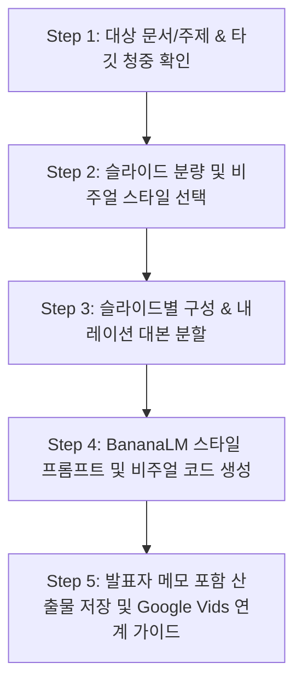

# Slide & Video Production Pipeline (슬라이드 & AI 영상 제작 스킬)

**Slide Video Pipeline**은 학습 노트, 리서치 보고서, 기획안을 입력받아 **"텍스트 리서치 ➡️ 개요 ➡️ 슬라이드 분할 & 내레이션 대본 ➡️ 스타일 프롬프트 생성 ➡️ 발표자 메모(Speaker Notes) 탑재 PPTX/HTML"**까지 원스톱으로 제작하는 13단계 E2E 제작 스킬입니다.

---

## 🎯 제1원칙 (First Principle)

> **"슬라이드와 비디오를 만들기 전에, 반드시 완성형 텍스트와 스토리라인을 먼저 확립한다."**
> - 비주얼 도구(Banana LM, Gamma 등)에 의존하기 전, **자료 수집 → 개요 정리 → 완성형 본문 글**의 텍스트 빌드업이 선행되어야 고품질 슬라이드와 AI 영상 더빙이 완성됩니다.

---

## 🎨 BananaLM & 모던 프레젠테이션 스타일 프리셋 라이브러리

사용자가 스타일을 지정하거나 선택할 수 있도록 다음 7가지 핵심 스타일 프리셋을 제공합니다:

| 번호 | 스타일 명칭 | 비주얼 특징 | 추천 적용 분야 | 대표 색상 팔레트 |
| :---: | :--- | :--- | :--- | :--- |
| **1** | **Memphis Flat Corporate** (멤피스 플랫 코퍼레이트) | 모던 플랫 벡터, 기하학적 멤피스 패턴, 친근한 IT 테크 기업 감성 | 테크 기업 세미나, 서비스 소개, 사내 교육 | `#3B5998`(Blue), `#FF6B6B`(Red), `#FFD93D`(Yellow) |
| **2** | **Cyberpunk Neon Dark** (사이버펑크 네온 다크) | 딥 다크 배경(#0A0E17), 네온 발광 효과(Glow), HUD/사이버네틱 도해 | AI 아키텍처, 해커톤 피칭, 차세대 기술 브리핑 | `#0A0E17`(BG), `#00F5FF`(Cyan), `#FF007F`(Magenta) |
| **3** | **Swiss Minimal & Bauhaus** (스위스 인터내셔널 미니멀) | 엄격한 그리드 시스템, 볼드한 산세리프 타이포그래피, 극도의 여백미 | 경영진 보고, 학술 연구, 핵심 수치/지표 강조 | `#FFFFFF`(BG), `#111111`(Black), `#E63946`(Accent Red) |
| **4** | **Warm Editorial & Notion** (웜 에디토리얼) | 따뜻한 크림/아이보리 배경, 세리프 헤드라인, 정갈한 펜 라인 드로잉 | 독서 토론, 인사이트 에세이, 리서치 리뷰 | `#FAF7F2`(Cream), `#2C3E50`(Navy), `#D35400`(Amber) |
| **5** | **Glassmorphism Fintech** (글래스모피즘 핀테크) | 반투명 유리 카드 덱(Backdrop-filter), 부드러운 그라디언트, 입체감 | 금융/투자 IR, 데이터 대시보드, 제품 로드맵 | `#1E1B4B`(Dark Violet), `#38BDF8`(Sky), Frost White |
| **6** | **Neo-Brutalism Bold** (네오 브루탈리즘 볼드) | 굵은 검은색 스트로크, 하드 드롭 섀도우(No-blur), 팝 컬러 블록 | MZ 타깃 콘텐츠, 유튜브 썸네일/숏폼, 파괴적 혁신 피칭 | `#FFE600`(Yellow), `#000000`(Stroke), `#FF5E5B`(Coral) |
| **7** | **Executive Navy & Gold** (임원 보고 정통 비즈니스) | 딥 네이비 배경/카드, 샴페인 골드 포인트, 정형화된 3단 카드 레이아웃 | 임원 주간 회의, 전략 기획 보고, B2B 제안서 | `#0B192C`(Navy), `#D4AF37`(Gold), `#F5F5F7`(Light Gray) |

---

## 🛠️ 대화형 5단계 인터뷰 & 제작 프로세스

### Step 1: 소스 입력 및 기획 의도 확인
- 입력된 문서(또는 위키 내 파일 링크)의 핵심 논점 추출.
- 타깃 청중(경영진, 엔지니어, 대중, 유튜브 시청자 등) 및 핵심 전달 메시지 확정.

### Step 2: 포맷 및 스타일 선택지 제시
- 슬라이드 매수 (예: 5장, 8장, 12장).
- 위의 **7대 스타일 프리셋 (또는 사용자 맞춤 커스텀 스타일)** 중 하나를 선택받음.

### Step 3: 슬라이드별 뼈대 & 발표자 내레이션 대본 도출
각 슬라이드마다 다음 4대 요소를 명확히 분할:
1. **슬라이드 제목 및 핵심 키워드**
2. **화면 표시 내용 (텍스트/수치/다이어그램 - 최대 5블록 제한)**
3. **발표자 메모 (Speaker Notes):** Google Vids나 TTS에서 그대로 읽을 2~4문장의 완결된 구어체 대본.
4. **비주얼 연출 지침**

### Step 4: BananaLM 스타일 프롬프트 생성
선택된 스타일 프리셋에 맞추어 이미지 생성기(BananaLM, Midjourney, DALL-E)에 즉시 복사해 넣을 수 있는 정밀 프롬프트 블록 제공.

### Step 5: 산출물 저장
- 완성된 기획안을 `_sources/Study/AI-Prompt/Slide-Generation/` 또는 `projects/` 하위에 마크다운 파일로 저장.
- PPTX / HTML 슬라이드 코드(Reveal.js / Marp 등) 제공.

---

## 💬 호출 트리거
- `"/slide-video"`
- *"슬라이드 만들어줘"*
- *"발표 자료 만들어줘"*
- *"슬라이드 영상 워크플로우 돌려줘"*
- *"PPT 제작해줘"*
- *"대본이랑 슬라이드 프롬프트 짜줘"*
