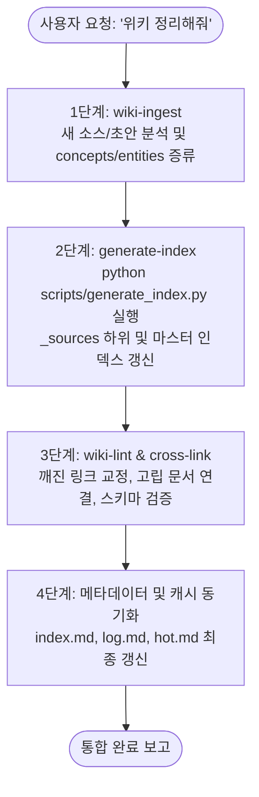

# Wiki Organize — 올인원 3단계 자동 위키 정리 파이프라인

사용자가 **"위키 정리해줘"**, **"공부한 거 정리해줘"**, 또는 **`/wiki-organize`**를 요청했을 때,
개별 스킬을 하나씩 호출하지 않고 **[1. Ingest ➡️ 2. Generate-Index ➡️ 3. Wiki-Lint & Link]** 의
3단계를 순서대로 자동 완결하는 종합 파이프라인 스킬입니다.

---

## 🚀 파이프라인 실행 3단계 절차



---

### Step 1: 지식 증류 (wiki-ingest)
1. **대상 탐색:**
   - `_raw/` 폴더 내의 미정리 임시 메모/초안
   - `_sources/Study/`, `_sources/News/` 등 최근 작성·수정된 학습 노트
2. **지식 컴파일:**
   - 추상적 원리, 설계 패턴 ➡️ `concepts/` 페이지 생성/업데이트
   - 구체적 도구, 라이브러리, 프레임워크 ➡️ `entities/` 페이지 생성/업데이트
   - 기존 문서가 존재하면 새로 파일을 늘리지 않고 기존 문서를 진화(Compile, don't duplicate)시킴.
3. **프론트매터 및 요약 생성:**
   - `title`, `category`, `tags`, `sources`, `created`, `updated`, `summary` 필드 필수 부여.
   - `.manifest.json`에 처리된 소스 해시 및 산출물 매핑 저장.

---

### Step 2: 소스 인덱스 자동 동기화 (generate-index)
1. **스크립트 자동 실행:**
   ```powershell
   $env:PYTHONIOENCODING="utf-8"; python scripts/generate_index.py
   ```
2. **검증:**
   - `_sources/` 내 모든 하위 디렉토리(Study, News, Projects 등)의 `_index.md` 갱신 확인.
   - 마스터 인덱스(`_sources/_index.md`)에 누락된 폴더 링크가 없는지 확인.

---

### Step 3: 지식망 연결 및 건전성 검사 (wiki-lint & cross-link)
1. **링크 무결성 검사 (Broken Links):**
   - 볼트 내 `[[wikilinks]]`를 전수 검사하여 대상이 없는 링크 탐지 및 교정.
2. **고립 문서 구출 (Orphan Rescue & Cross-linking):**
   - 인입 링크(Incoming links)가 0인 문서를 찾아, 관련 상위 개념(`concepts/`)이나 워크플로우 문서에 상호 링크(`[[wikilinks]]`) 추가.
3. **프론트매터 및 태그 정합성 검사:**
   - 누락된 스키마 필드가 없도록 보정.
4. **마스터 색인 및 시스템 로그 갱신:**
   - `index.md`: 신규 추가된 페이지 알파벳순 등록.
   - `log.md`: 파이프라인 수행 이력 타임스탬프 기록.
   - `hot.md`: 다음 작업 세션을 위한 Recent Activity 및 핫 캐시 요약 갱신.

---

## 📊 최종 보고 양식 (User Output)

3단계 파이프라인이 완료되면 사용자에게 다음과 같이 일목요연하게 보고합니다:

```markdown
### 🚀 위키 자동 정리 파이프라인 완료

1. **지식 인제스트 (wiki-ingest):**
   - 생성/수정된 Concepts: [[concepts/...]]
   - 생성/수정된 Entities: [[entities/...]]
2. **소스 인덱스 동기화 (generate-index):**
   - N개 폴더, M개 소스 파일 인덱싱 완료 (`_sources/_index.md`)
3. **건전성 및 링크 점검 (wiki-lint & link):**
   - 깨진 링크: 0건 (교정 완료)
   - 고립 문서: 상호 링크 연결 완료
   - 마스터 인덱스(index.md) 및 세션 핫 캐시(hot.md) 갱신 완료
```
