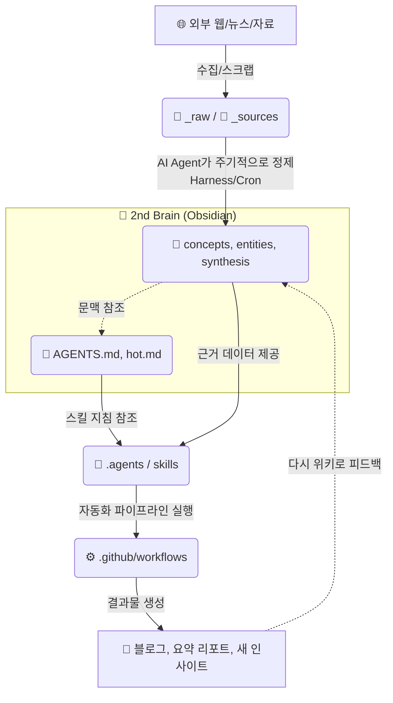

# 🧠 AI-Native 2nd Brain 최적화 폴더 구조 가이드

단순히 메모를 적어두는 기존의 위키(Zettelkasten) 방식을 넘어, **AI 에이전트가 내 지식을 학습하고, 자동화 파이프라인(Harness)이 스스로 동작하며, 스킬(Skill)을 확장할 수 있는 "능동형(Agentic) 2nd Brain"** 의 최적화된 폴더 구조입니다.

## 📂 추천 폴더 구조 (Tree)

전체 구조는 크게 **(1) 인간 지식 영역**, **(2) AI 에이전트 및 자동화 영역**, **(3) 외부 데이터 수집 영역**의 3계층으로 나뉩니다.

```text
📁 MyWiki (Vault Root)
 ├── 📄 AGENTS.md            # [핵심] 모든 AI 에이전트가 읽고 따르는 페르소나 및 위키 규칙 (프롬프트 허브)
 ├── 📄 index.md             # 인간과 AI가 공통으로 참조하는 위키의 메인 목차
 ├── 📄 hot.md               # 최근 작업/사고의 컨텍스트를 유지하는 캐시 파일 (AI 메모리 역할)
 │
 ├── 📁 1. Knowledge (인간 지식 영역 - Obsidian Core)
 │   ├── 📁 concepts/        # 추상적 개념, 패턴, 멘탈 모델 (예: llm-wiki-vs-rag.md)
 │   ├── 📁 entities/        # 구체적인 대상 (인물, 도구, 기업, 라이브러리)
 │   ├── 📁 synthesis/       # 여러 개념을 엮은 종합/분석 리포트
 │   └── 📁 journal/         # 시간 기반의 기록 (데일리 로그, 아이디어 메모)
 │
 ├── 📁 2. Agents & Skills (AI 행동 영역 - 능동형 뇌)
 │   ├── 📁 .agents/         # (또는 .skills) AI가 수행할 행동 지침(SKILL.md) 모음
 │   │   ├── 📁 news-summarizer/
 │   │   └── 📁 wiki-research/
 │   ├── 📁 .github/         # 자동화 하네스(Harness) - CI/CD 및 크론잡 스케줄링
 │   │   └── 📁 workflows/   # 에이전트의 정기적 실행을 담당 (예: agent_news_summarizer.yml)
 │   └── 📁 scripts/         # 에이전트나 시스템이 사용할 공통 Python/Bash 스크립트
 │
 ├── 📁 3. Sources & Raw (데이터 파이프라인 영역)
 │   ├── 📁 _sources/        # 체계적으로 관리되는 외부 출처 파일 (코드 프로젝트, 강의 자료)
 │   │   ├── 📁 Projects/    # AI가 동작시키는 코드(예: NewsSummarizer)
 │   │   └── 📁 Study/       # 원본 강의 자료, PDF 등
 │   ├── 📁 _raw/            # (Staging) 정제되지 않은 스크랩, 대화 기록이 임시로 머무는 곳
 │   └── 📁 _archives/       # 처리 완료 후 보관되는 영구 저장소
```

---

## 🏗️ 3단계 계층별 상세 역할

### Layer 1: 인간 지식 영역 (Knowledge)
* **목적:** AI가 읽고 답변의 근거로 삼는 **"정제된 진짜 내 생각(Ground Truth)"** 입니다.
* **특징:** RAG(검색 증강 생성) 환경에서 AI가 가장 먼저 검색하는 핵심 노드들입니다. `concepts`, `entities` 폴더가 여기에 해당하며, 마크다운 링크(`[[ ]]`)를 통해 강하게 결합되어 있어야 합니다.

### Layer 2: AI 행동 영역 (Agents, Skills, Harness)
* **목적:** AI가 단순한 텍스트 앵무새를 넘어, **실제 행동(Action)을 하도록 만드는 팔다리 역할**을 합니다.
* **`.agents` (Skills):** 특정 목적을 달성하기 위한 AI의 행동 강령(`SKILL.md`)이 담깁니다. "뉴스를 요약할 땐 이렇게 해", "코드를 짤 땐 이 규칙을 따라" 등의 지시사항입니다.
* **`.github` (Harness):** 에이전트가 내가 자는 동안에도 스스로 일하게 만드는 **심장 박동(Heartbeat)** 입니다. 타이머(Cron)에 맞춰 에이전트를 깨우고 스크립트를 실행시킵니다.

### Layer 3: 데이터 파이프라인 영역 (Sources, Raw)
* **목적:** 외부 세계의 정보를 위키 내부로 흡수하는 **소화 기관**입니다.
* **`_raw`:** 웹 서핑 중 긁어온 글, AI와의 쓸데없는 대화 기록 등을 일단 던져두는 곳입니다. 이후 AI 에이전트가 이곳을 스캔하여 중요한 것만 `Knowledge` 영역으로 끌어올립니다(Promote).
* **`_sources`:** 우리가 방금 만든 뉴스 요약기(`Projects/NewsSummarizer`)처럼, 텍스트가 아닌 '실행 가능한 코드'나 '무거운 강의 자료'를 안전하게 격리 보관하는 곳입니다.

---

## 🔄 데이터 흐름 도식화 (Mermaid)

아래는 정보가 위키로 들어와서 AI의 행동으로 이어지는 데이터 흐름도입니다.



## 💡 요약: 기존 위키와 무엇이 다른가?
기존의 위키가 **"내가 읽고 내가 쓰는 노트"** 였다면, 이 구조는 **"AI와 내가 함께 가꾸는 거대한 정원"** 입니다.
- `AGENTS.md`를 통해 정원의 규칙을 세우고
- `.github`를 통해 AI에게 물주는 시간(Cron)을 지정해주며
- `_sources`를 통해 삽과 가위(코드/스크립트)를 관리하는 방식입니다.
