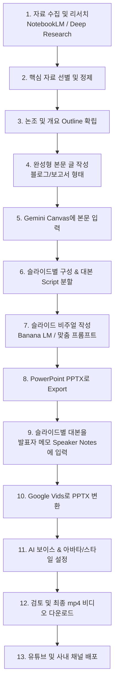

# 🎬 내가 슬라이드형 동영상을 만드는 워크플로우 (청출어람 20260525)

## 📌 영상 정보
- **강의 제목:** 내가 슬라이드형 동영상을 만드는 워크플로우
- **출처:** [YouTube 영상 바로가기](https://www.youtube.com/watch?v=dIhpspqDvmU)
- **핵심 도구:** NotebookLM, Gemini Canvas, Banana LM (또는 슬라이드 생성 도구), PowerPoint, Google Vids

---

## 💡 핵심 인사이트 & 제1원칙 (Key Takeaway)

> [!IMPORTANT]
> **"슬라이드와 영상을 만들기 전에, 반드시 내용과 스토리라인을 완성해야 한다."**
> - 아무리 뛰어난 AI 도구(Banana LM, Gamma, Google Vids 등)를 쓰더라도, **LLM이 콘텐츠의 본질과 핵심 논리, 스토리라인을 알아서 대신 기획해주지 않습니다.**
> - **텍스트 본문(글)의 완성도**가 곧 **슬라이드와 비디오의 완성도**를 결정합니다.
> - "자료 수집 → 개요 정리 → 본문 작성"의 텍스트 빌드업 과정이 선행되어야 신속하고 친숙한 비주얼 영상 제작이 가능합니다.

---

## 🛠️ 13단계 E2E 슬라이드 영상 제작 파이프라인

### 단계별 상세 가이드

1. **자료 수집 및 조사 (NotebookLM / Deep Research):**
   - 연구 논문(PDF), 웹 문서, 유튜브 영상, 보고서 등 관련 소스 자료를 NotebookLM에 집중 업로드.
2. **필요 자료 선별 및 정제:**
   - 핵심 개념과 유용한 통계, 인사이트를 필터링하여 노이즈 제거.
3. **개요(Outline) 및 논조 수립:**
   - NotebookLM 채팅창에 프롬프트를 입력하여, 전달하고자 하는 메시지와 타깃 청중의 눈높이에 맞춘 목차 및 개요 작성.
4. **완성형 텍스트(본문) 작성:**
   - 개요를 바탕으로 블로그 포스팅이나 보고서 형식의 **완결된 줄글(Content)**을 먼저 작성 (스토리라인의 뼈대 완성).
5. **Gemini Canvas (또는 LLM 캔버스)에 입력:**
   - 작성된 완성형 본문을 복사하여 Gemini Canvas에 로드.
6. **슬라이드별 분할 및 대본(Script) 도출:**
   - Canvas의 편집 기능을 활용하여 슬라이드 매수(예: 5~10장)와 장별 핵심 키워드, 그리고 말로 읽을 **'내레이션 대본'**을 도출.
7. **슬라이드 생성 및 비주얼 디자인 (Banana LM / 템플릿 프롬프트):**
   - 맞춤형 스타일 프롬프트(멤피스 플랫 스타일, 사이버펑크 네온 등)를 적용하여 슬라이드 비주얼 및 다이어그램 생성.
8. **PowerPoint(PPTX)로 내보내기 (Export):**
   - 생성된 슬라이드들을 표준 PPTX 파일로 저장.
9. **발표자 메모(Speaker Notes)에 대본 삽입:**
   - 각 슬라이드의 '발표자 메모' 칸에 6단계에서 만든 내레이션 대본을 정확히 붙여넣기 (Google Vids 연동의 핵심).
10. **Google Vids로 프로젝트 변환:**
    - Google Vids에 접속하여 작성된 PowerPoint 파일을 업로드/가져오기.
11. **AI 보이스 및 아바타 설정:**
    - 청중에게 맞는 자연스러운 한국어 AI 음성 선택, 필요 시 아바타 위치 및 배경 효과 지정.
12. **최종 프리뷰 및 mp4 렌더링:**
    - 슬라이드 전환 시간, 자막 싱크, 음성 발음을 확인한 후 mp4 고화질 비디오로 렌더링 다운로드.
13. **유튜브 및 플랫폼 배포:**
    - 유튜브 썸네일, 챕터, 설명란과 함께 최종 영상 게시.

---

## 🔗 관련 핵심 링크 모음

### 1. 영상 및 제작 도구 링크
- 🎥 **YouTube 원본 영상:** [내가 슬라이드형 동영상을 만드는 워크플로우 (20260525)](https://www.youtube.com/watch?v=dIhpspqDvmU)
- 📓 **Google NotebookLM:** [https://notebooklm.google.com/](https://notebooklm.google.com/)
- 🎨 **Google Gemini Canvas:** [https://gemini.google.com/](https://gemini.google.com/)
- 🎬 **Google Vids:** [https://workspace.google.com/products/vids/](https://workspace.google.com/products/vids/)

### 2. 세컨드 브레인 연구 핵심 참조 자료 (오늘 학습 연계)
- 📄 **MemGPT 논문 (arXiv:2310.08560):** [MemGPT: Towards LLMs as Operating Systems](https://arxiv.org/abs/2310.08560)
- 🕸️ **GraphRAG 아키텍처 가이드:** [PuppyGraph - GraphRAG Architecture](https://www.puppygraph.com/blog/graphrag-architecture)
- 🐙 **Awesome Second Brain GitHub:** [aristoapp/awesome-second-brain](https://github.com/aristoapp/awesome-second-brain)
- 📊 **서울대 LLM 세컨드 브레인 연구 보고서:** `Research_report_LLM_2nd_Brain_Seoul (1).md`

---

## 📁 재사용 프롬프트 보관소 안내
오늘 학습한 전문 프롬프트들은 향후 다양한 주제로 슬라이드/영상을 제작할 때 즉시 복사하여 재사용할 수 있도록 `_sources/Study/AI-Prompt/` 경로에 분류하여 저장되었습니다:
- 📄 **보고서 생성 프롬프트:** [_sources/Study/AI-Prompt/Content-Drafting/second_brain_report_prompt.md](file:///c:/Users/kihok/내%20드라이브/MyWiki/_sources/Study/AI-Prompt/Content-Drafting/second_brain_report_prompt.md)
- 🎨 **멤피스 플랫 슬라이드 프롬프트:** [_sources/Study/AI-Prompt/Slide-Generation/memphis_flat_slide_prompt.md](file:///c:/Users/kihok/내%20드라이브/MyWiki/_sources/Study/AI-Prompt/Slide-Generation/memphis_flat_slide_prompt.md)
- ⚡ **사이버펑크 네온 슬라이드 프롬프트:** [_sources/Study/AI-Prompt/Slide-Generation/cyberpunk_neon_slide_prompt.md](file:///c:/Users/kihok/내%20드라이브/MyWiki/_sources/Study/AI-Prompt/Slide-Generation/cyberpunk_neon_slide_prompt.md)
