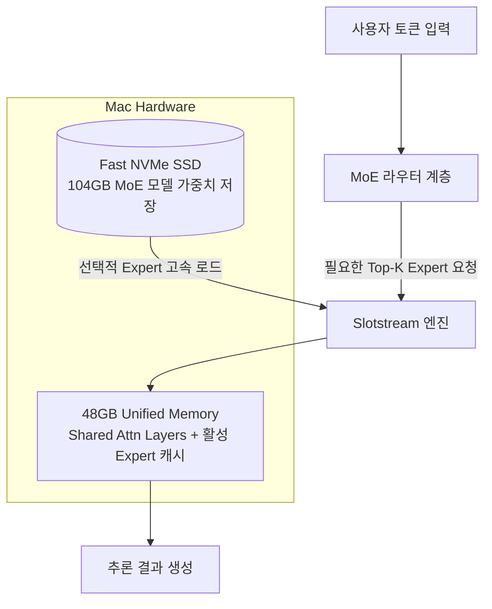

# 🚀 [2026-09-03] IT 뉴스 추천 GitHub 리포 심층 스터디

> **출처:** [2026년 9월 3일 IT뉴스 — JIWU Mission](https://jesusiswith.us/digest/daily-it-news/2026/2026-09-03/)  
> **핵심 테마:** **"비용 절감(토큰 압축), 한계 돌파(SSD MoE 스트리밍), 로컬 프라이버시(로컬 코딩 에이전트), 실전 사역 버티컬 AI"**

---

## 💡 핵심 인사이트 (Key Takeaways)

> [!IMPORTANT]
> **2026년 9월 오픈소스 AI 생태계의 화두는 "비용(Cost)과 로컬 구동 한계 돌파(Hardware Boundary Breaker)"입니다.**
> 1. **토큰 압축(Headroom):** 무거운 도구 출력과 JSON 로그를 사전에 압축하여 에이전트 루프 비용을 최대 60~95% 절감하고 컨텍스트 윈도우 낭비를 방지.
> 2. **MoE 스트리밍(Slotstream):** 고가의 대용량 메모리 없이도 104GB MoE 모델을 48GB Mac에서 NVMe SSD 전문가 스트리밍(MLX)으로 구동.
> 3. **로컬 코딩 에이전트(Smolcoder):** API 종속 없이 Ollama/LM Studio 기반 로컬 LLM으로 개인화된 터미널 에이전트 환경 구축.
> 4. **버티컬 실시간 AI(Rhema):** 음성 인식(STT)과 지식 검색을 NDI 방송 인터페이스와 결합한 실시간 미디어 파이프라인.

---

## 🛠️ 추천 GitHub 리포지토리 4종 심층 분석

### 1. 🗜️ Headroom — LLM 사전 컨텍스트 압축 프록시 & MCP 서버

- **GitHub:** [`headroomlabs-ai/headroom`](https://github.com/headroomlabs-ai/headroom)
- **스펙:** Python | Apache-2.0 | Star 64k+ (트렌딩)
- **한 줄 요약:** 도구 실행 결과, 시스템 로그, 웹 크롤링 결과, JSON 데이터를 LLM에 전달하기 직전에 무손실/최소손실 압축하여 토큰 소모를 대폭 줄여주는 라이브러리 및 MCP 프록시 서버.

#### 🔍 기술적 분석 및 왜 중요한가?
- **에이전트 루프의 컨텍스트 비대증(Context Bloat) 해결:** 에이전트가 `run_command`, `grep_search`, `read_url_content` 등을 수행할 때 수만 줄의 JSON이나 HTML/로그가 컨텍스트를 잠식하여 비용 급증 및 모델 주의력(Attention) 분산을 초래합니다.
- **압축률:** 코딩 에이전트 환경에서 전체 토큰 약 20% 절감, 구조화된 JSON 데이터의 경우 **60~95%** 압축 달성.
- **MCP(Model Context Protocol) 지원:** 프록시 또는 독립 MCP 서버로 구동할 수 있어, Claude Code, Cursor, Antigravity 등의 도구 체인 사이에 플러그인 형태로 즉시 끼워넣을 수 있습니다.

---

### 2. ⚡ Slotstream — 104GB 모델을 48GB Mac에서 돌리는 MoE 가중치 스트리머

- **GitHub:** [`carloslfu/slotstream`](https://github.com/carloslfu/slotstream)
- **스펙:** Swift + MLX | MIT | Hacker News 주간 1위권
- **한 줄 요약:** 4비트 양자화 기준 104GB에 달하는 Qwen3.8-Flash-Next(125B MoE)를 고속 NVMe SSD에서 활성화된 전문가(Expert)만 스트리밍하여 48GB RAM Mac에서 구동하는 기술.

#### 🔍 기술적 분석 및 왜 중요한가?
- **MoE(Mixture of Experts)의 특성 활용:** MoE 아키텍처는 전체 파라미터가 125B라도 특정 토큰을 처리할 때 활성화되는 파라미터(Active Parameters)는 20~30B 미만입니다.
- **SSD-to-RAM 파이프라이닝:** 전체 모델을 VRAM에 상주시킬 필요 없이, 공통 Attention 가중치만 RAM에 두고 Expert 계층은 SSD 대역폭을 활용해 온디맨드로 스트리밍합니다.
- **의의:** 애플 실리콘(M2/M3/M4) 통합 메모리의 높은 대역폭과 고속 SSD를 활용해 개인 로컬 머신에서 초대형 프런티어급 모델을 구동할 수 있는 길을 열었습니다. (Ollama 호환 엔드포인트 제공)

---

### 3. 💻 Smolcoder — 로컬 LLM 전용 터미널 코딩 에이전트

- **GitHub:** [`leonvanzyl/smolcoder`](https://github.com/leonvanzyl/smolcoder)
- **스펙:** TypeScript | MIT | 2026-09-02 공개
- **한 줄 요약:** Ollama 및 LM Studio와 완벽하게 호환되는 초경량 로컬 전용 터미널 코딩 에이전트.

#### 🔍 기술적 분석 및 왜 중요한가?
- **Claude Fable 5.1 바이브 코딩 실증:** 유튜버 Leon van Zyl이 앤스로픽의 신규 모델 Claude Fable 5.1을 활용해 기획부터 npm 패키지 배포까지 반나절 만에 제작한 프로젝트입니다.
- **로컬 자립형 에이전트:** 클라우드 API 호출 비용이 전혀 들지 않으며, 소스코드가 외부로 유출되지 않는 완전한 폐쇄망/로컬 작업이 가능합니다.
- **간결한 아키텍처:** 복잡한 프레임워크 없이 에이전트의 핵심 루프(Plan-Act-Observe-Diff)를 TypeScript 수백 줄로 미니멀하게 구현하여 에이전트 학습 교재로도 매우 훌륭합니다.

---

### 4. 🎙️ Rhema — 실시간 설교 인용 성경 자동 감지 및 NDI 자막 송출

- **GitHub:** [`openbezal/rhema`](https://github.com/openbezal/rhema)
- **스펙:** Tauri + TypeScript | MIT | Star 340+
- **한 줄 요약:** 실시간 음성을 분석하여 설교 중 인용되는 성경 구절(예: "요한복음 3장 16절")을 AI가 자동 검출하여 방송 자막으로 NDI 송출하는 데스크톱 앱.

#### 🔍 기술적 분석 및 왜 중요한가?
- **버티컬 현장 문제 해결:** 예배/방송 미디어팀 봉사자가 실시간으로 성경 구절을 손으로 검색하고 오버레이하던 고강도 수작업을 On-Device AI로 자동화.
- **NDI(Network Device Interface) 방송 표준 채택:** 일반 텍스트 파일이나 웹뷰가 아닌 방송 표준 NDI 알파 채널로 비디오 스트림을 내보내므로, OBS나 ATEM 스위처에 드롭인으로 연결 가능.
- **Tauri 기반 고성능 경량화:** Electron 대비 메모리 소모가 적고 네이티브 오디오 처리에 최적화.

---

## 🌐 오늘 IT 뉴스 종합 트렌드와의 연결 고리

| 9월 3일 IT 뉴스 토픽 | 본질적인 업계 흐름 | 추천 GitHub 리포와의 연계점 |
| :--- | :--- | :--- |
| **Claude Fable 5.1 (비용 45% 절감)** | LLM 성능 경쟁에서 **추론/운영 비용 최적화**로 이동 | **Headroom**과 결합 시 토큰 비용을 이중으로 절감하여 에이전트 상용화 가속 |
| **OpenAI Astra ('크리티컬' 사이버 위험)** | 프런티어 모델의 자율 해킹 및 취약점 탐지 능력 통제 | 자율 에이전트의 권한 통제 및 프라이빗 환경 필요성 대두 |
| **퍼플렉시티 Mac 하이브리드 AI** | 민감 데이터는 로컬에서, 복잡한 처리는 클라우드로 분할 | **Slotstream** & **Smolcoder**를 통한 로컬 인프라 강화 흐름과 일치 |
| **우버 3,300명 감원 & 로보택시 재배치** | 전통 조직 관료제 축소 및 AI/자율주행 인프라 집중 투자 | AI 기반 실시간 자동화 도구(**Rhema** 등)의 현장 침투 트렌드 |

---

## 🎯 MyWiki & 내 업무에 적용할 아이디어 (Action Plan)

1. **Agentic 워크플로우에 Headroom 패턴 적용 검토:**
   - Obsidian Wiki 에이전트(`wiki-ingest`, `generate-index`) 실행 시, 긴 로그나 웹 크롤링 원문에서 불필요한 공백/중복 JSON을 축약하여 토큰 사용량 최소화.
2. **Mac 로컬 환경에서 Slotstream 테스트:**
   - 추후 로컬 LLM(Qwen MoE 계열)을 온디바이스로 구동하여 프라이빗 문서 분석 및 오프라인 질의응답 구축에 활용 가능성 탐색.
3. **Rhema 아키텍처 벤치마킹:**
   - 음성 실시간 감지 + 로컬 엔티티 매칭 + 방송 송출 파이프라인의 구조는 강의/세미나 실시간 요약 시스템 구축에도 동일하게 응용 가능.
