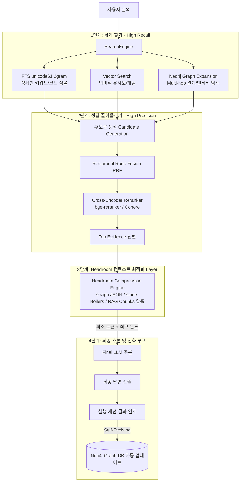

# 🧠 Headroom 심층 분석 및 Group 2nd Brain 아키텍처 구축 가이드

> **GitHub 저장소:** [https://github.com/headroomlabs-ai/headroom](https://github.com/headroomlabs-ai/headroom)  
> **라이선스:** Apache-2.0 | **주요 언어:** Python / TypeScript | **Star 수:** 64,000+  
> **핵심 정의:** LLM 및 에이전트 루프에 전달되기 전, 도구 출력·로그·대용량 JSON·RAG 청크의 의미적 손실 없이 토큰을 20%~95% 사전 압축하는 **컨텍스트 최적화 프록시 & MCP 서버**

---

## 1. Headroom 상세 분석

### 1.1 탄생 배경: 에이전트의 "컨텍스트 비대증(Context Bloat)"
최근 LangGraph, Claude Code, Cursor, Antigravity 등 에이전틱 워크플로우가 확산되면서 심각한 문제가 대두되었습니다:
1. **토큰 폭발(Cost Inflation):** 에이전트가 `grep`, `bash`, `Cypher query`, `git diff` 등을 반복 실행할 때마다 수천~수만 줄의 원시 텍스트와 JSON이 프롬프트 히스토리에 누적됩니다.
2. **주의력 저하(Lost in the Middle):** LLM의 컨텍스트 윈도우가 1M~2M 토큰으로 늘어났지만, 입력 데이터에 불필요한 보일러플레이트, 중복 키, 공백이 많으면 핵심 증거(Top Evidence)에 대한 모델의 주의력(Attention)이 분산되어 환각과 오답률이 급증합니다.
3. **지연 시간(Latency):** 입력 토큰이 길어질수록 Time-to-First-Token(TTFT)이 기하급수적으로 증가합니다.

**Headroom은 모델과 도구/데이터 파이프라인 사이에 위치하여, LLM에 들어가기 직전 데이터를 압축하는 '고효율 필터' 역할을 수행합니다.**

---

### 1.2 Headroom의 핵심 기능 및 성능

| 기능 항목 | 상세 내용 | 압축 효과 |
| :--- | :--- | :--- |
| **구조화 데이터 압축** | JSON, API 응답, AST, 시스템 로그의 중복 키/보일러플레이트 무손실 정제 | **60% ~ 95% 절감** |
| **코딩 에이전트 최적화** | 컴파일 로그, linter 출력, bash 실행 결과의 핵심 에러 및 맥락만 보존 | **평균 20% 절감** |
| **Reversible Compression (CCR)** | 압축된 데이터의 원래 소스 역추적이 필요한 경우 복원 가능 메타데이터 유지 | 완벽한 인용(Citation) 보장 |
| **Verbosity Steering** | 입력 압축뿐 아니라 LLM이 출력할 때 군더더기 서술을 줄이도록 가이딩 | 출력 토큰 절감 |
| **Effort Routing** | 쿼리의 복잡도에 따라 모델의 추론 노력도(Thinking budget)를 동적 조절 | 불필요한 고비용 추론 방지 |

---

### 1.3 4가지 배포 및 연동 방식 (Deployment Modes)

```mermaid
flowchart TD
    subgraph Execution Modes
        A[1. Python/TS Library<br>from headroom import compress]
        B[2. Transparent Local Proxy<br>headroom proxy -> LLM Endpoint]
        C[3. CLI Agent Wrap<br>headroom wrap claude / cursor]
        D[4. MCP Server<br>Model Context Protocol 네이티브 연동]
    end
    Data[도구 실행 / RAG 청크 / Graph Query 결과] --> Execution Modes
    Execution Modes -->|토큰 20~95% 압축| LLM[LLM Context Window]
```

1. **라이브러리 모드 (`Library Mode`):**
   ```python
   from headroom import compress
   
   # Graph DB Cypher 쿼리 결과(수백 개의 노드/엣지 JSON)를 압축
   compressed_graph_context = compress(raw_graph_json, format="json", aggressiveness="balanced")
   ```
2. **로컬 투명 프록시 (`Transparent Proxy Mode`):**
   - `headroom proxy --port 8080 --upstream https://api.anthropic.com`
   - 기존 앱의 `baseURL`만 변경하면 코드 수정 없이 모든 입출력 자동 압축.
3. **CLI 에이전트 래퍼 (`Agent Wrap Mode`):**
   - `headroom wrap claude` 또는 `headroom wrap aider` 형태로 실행하여 터미널 에이전트 세션의 컨텍스트를 실시간 관리.
4. **MCP 서버 모드 (`Model Context Protocol Mode`):**
   - Cursor, Antigravity, Claude Code의 MCP config에 추가하여 에이전트가 호출하는 툴들의 반환값을 자동으로 축약.

---

## 2. 우리 그룹의 "Group 2nd Brain" 아키텍처와 Headroom의 접목

현재 그룹에서 고민 중인 해커톤 입상 아이디어와 검색 고도화 구축안은 매우 진보적인 엔터프라이즈 아키텍처를 지향하고 있습니다.

### 2.1 그룹의 기존 설계안 요약
1. **Reference Flow 기반 도메인 독립 구조:** Lint, CDC 등 특정 도메인에 갇히지 않는 표준 에이전트 파이프라인.
2. **Neo4j Graph DB 도입 (KG-MCP):** Vector DB(유사도 검색)의 한계를 극복하고, 여러 문서에 흩어진 관계를 추론하여 **정답률 50%p 이상 개선**.
3. **진화형 설계 (Self-Evolving Loop):** 실행-개선-결과 인지 구조로 Graph DB에 피드백을 축적하여 모델 교체 없이도 성능 향상.
4. **검색 파이프라인:**
   `User Query` ➡️ `2-gram FTS + Vector + Graph Expansion` ➡️ `Candidate Generation` ➡️ `RRF (합치기)` ➡️ `Reranker (재정렬)` ➡️ `Top Evidence` ➡️ `LLM Final Answer`

---

### 2.2 Headroom이 반드시 투입되어야 하는 "결정적 위치"

위 그룹 파이프라인에서 가장 큰 병목이 발생하는 곳은 바로 **`Reranker` 이후 `LLM에 전달`되는 구간**입니다.



#### 왜 Headroom이 필수적인가?
1. **Graph DB 쿼리 결과(Graph Expansion)의 토큰 폭발 방지:**
   - Neo4j에서 Multi-hop으로 노드와 엣지(관계)를 가져오면 노드 속성, ID, 연결 메타데이터 등 JSON 형태의 오버헤드가 엄청납니다.
   - Headroom을 거치면 Graph JSON의 문법적 보일러플레이트를 제거하고 LLM이 이해하기 가장 좋은 컴팩트 릴레이션 튜플 형태로 변환해 **토큰을 최대 80% 줄여줍니다.**
2. **Top Evidence의 밀도(Density) 극대화:**
   - Reranker가 상위 문서 5~10개를 골랐더라도, 각 문서 안에는 헤더, 저작권 문구, 무관한 함수 등이 섞여 있습니다.
   - Headroom이 질의(Query)와 무관한 청크 내 노이즈를 제거하여 LLM이 **"정답 토큰"에만 100% 어텐션을 집중**하게 만듭니다.

---

## 3. 코퍼스(Corpus) 규모 증가에 따른 검색 기법 성능 비교 & Onyx 인사이트

엔터프라이즈 환경에서 문서 수가 1천 개에서 10만, 100만 개로 증가할 때 검색 기법들의 거동은 완전히 달라집니다.

### 3.1 코퍼스 규모별 검색 기법 성능 매트릭스

| 코퍼스 규모 | Pure Vector Search | BM25 / FTS (2-gram) | Hybrid + RRF | Graph RAG (Neo4j) | Hybrid + Graph + Reranker (그룹 구축안) |
| :--- | :--- | :--- | :--- | :--- | :--- |
| **Small (< 1K)** | 🟢 우수 (단순 의미 검색 충분) | 🟡 보통 (오타/유의어 취약) | 🟢 우수 | 🟡 오버스펙 (구축 비용 큼) | 🟢 완벽 |
| **Medium (1K~50K)** | 🟡 저하 (유사 문서 클러스터링 혼선) | 🟢 우수 (고유명사/코드명 검색 강력) | 🟢 매우 우수 | 🟢 우수 (문서 간 연결 시작) | 🟢 최상 (권장 표준) |
| **Large (50K~500K)** | 🔴 심각 (허브성/밀집도 문제로 Recall 급락) | 🟡 저하 (동음이의어/문맥 누락) | 🟢 우수 (상호보완) | 🟢 필수 (도메인 지식 체계화) | 🟢 **압도적 (정답률 50%p 이상 격차)** |
| **Enterprise (> 1M)** | 🔴 사용 불가 (Noise 극대화) | 🟡 비용/인덱스 관리 부담 | 🟡 Reranker 연산 병목 발생 | 🟢 서브그래프 프루닝 필수 | 🟢 **Headroom 결합 시 비용/속도 안정화** |

> **학술 논문 및 벤치마크 핵심 결론:**
> 1. **Vector Search의 한계:** 데이터가 10만 건을 넘어서면 고차원 임베딩 공간에서 벡터들이 뭉치는 **"Hubness Problem"**이 발생하여 Top-K에 엉뚱한 문서들이 끼어듭니다.
> 2. **FTS (unicode61 2-gram)의 필연성:** 특히 한국어, C/C++ 심볼, Lint 규칙 코드(예: `CDC_CLK_001`)처럼 정확한 매칭이 필요한 사내 시스템에서는 2-gram 형태소/N-gram FTS가 초기 Recall을 확고하게 잡아줍니다.
> 3. **Graph RAG의 독점적 영역:** "A 모듈의 클럭 변경이 B 모듈과 C 검증 룰에 미치는 영향은?"과 같은 **다단계 연결 추론(Multi-hop Reasoning)**은 Vector DB로는 절대 풀 수 없으며 오직 Graph DB의 지식망(Knowledge Graph)으로만 해결됩니다.

---

### 3.2 엔터프라이즈 오픈소스 검색의 정점, Onyx(구 Danswer)의 설계 철학

Onyx는 수백 개 기업의 엔터프라이즈 RAG 시스템을 구축하며 다음 원칙을 정립했습니다:
1. **다단계 필터링 (Multi-stage Retrieval Pipeline):**
   - 1차: 빠른 Keyword(BM25) + Dense Vector로 후보군 100개 확보 (Recall 99% 확보)
   - 2차: RRF(Reciprocal Rank Fusion)로 순위 점수 정규화 합산
   - 3차: Cross-Encoder Reranker(예: bge-reranker-large, Cohere)를 사용해 100개 중 상위 7개로 압축 (Precision 극대화)
2. **Query Reformulation & HyDE:**
   - 사용자의 질문을 검색 친화적인 키워드 쿼리와 가상 답변(Hypothetical Document)으로 확장하여 검색기에 투입.
3. **Metadata & Graph Filtering:**
   - 권한(ACL) 및 프로젝트 계층 구조를 그래프 또는 메타데이터 필터로 사전에 잘라내어 검색 공간을 1/10로 축소.

---

## 4. 실행 권고: Group 2nd Brain을 위한 3단계 마일스톤

```
[Phase 1: Retrieval Core]
FTS (unicode61 2gram) + Neo4j Graph DB + Vector Search 구축 
  ↳ RRF 및 Cross-Encoder Reranker 파이프라인 정립

[Phase 2: Context Optimization - Headroom 적용]
Reranker 후단 및 MCP Tool 리턴값에 Headroom Layer 투입
  ↳ Graph JSON 및 Lint 로그 70%+ 압축 달성
  ↳ 토큰 비용 절감 및 LLM 추론 정확도 극대화

[Phase 3: Self-Evolving Feedback Loop]
LangGraph 에이전트 실행 결과 및 사용자 피드백을 Neo4j로 자동 회귀(Back-propagation)
  ↳ 모델 변경 없이 시간이 지날수록 똑똑해지는 지식 위키 완성
```

이 구조는 해커톤의 성공을 넘어 실제 엔터프라이즈 제품군(Lint 자동 분석, CDC 검증, 전사 지식 허브)으로 즉시 확장 가능한 최신 2026형 AI 아키텍처입니다.
