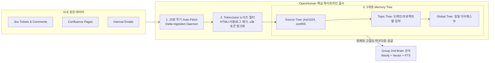
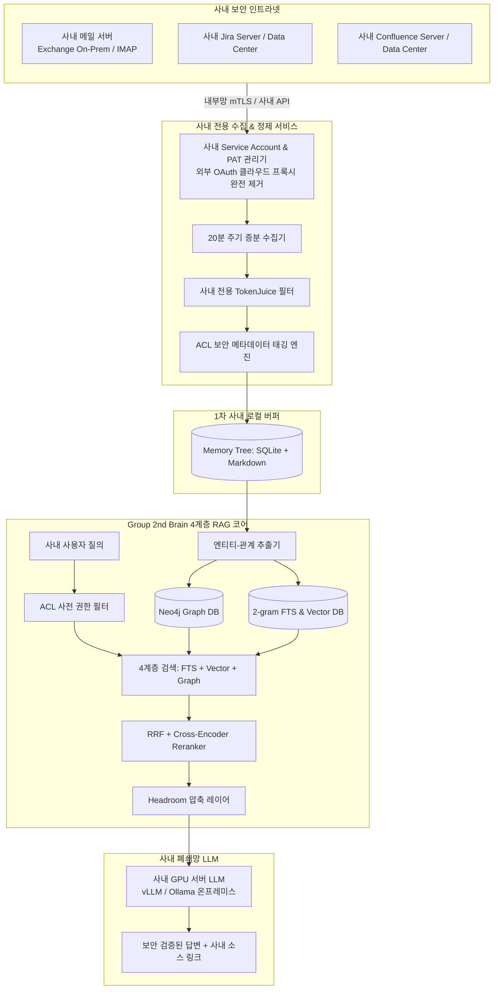

# 🧠 OpenHuman 심층 분석 및 사내 Group 2nd Brain 연계 구축 전략

> **분석 대상:** [tinyhumansai/openhuman](https://github.com/tinyhumansai/openhuman) (GitHub Stars 37,000+)  
> **연계 기준:** 2026년 9월 3일 수립된 [[Headroom_심층분석_및_Group_2nd_Brain_연계|Group 2nd Brain 아키텍처 구축 가이드]]  
> **핵심 목적:** 사내 보안 규정을 완벽히 준수하면서 사내 이메일, Jira, Confluence를 주기적으로 자동 수집·정제하여 엔터프라이즈 지식 DB로 활용하기 위한 실전 아키텍처 수립

---

## 1. 개요 및 분석 배경

2026년 9월 3일 정의된 우리 그룹의 **Group 2nd Brain**은 검색 정확도와 추론 밀도 측면에서 업계 최고 수준의 설계를 갖추고 있습니다:
- **4계층 검색 파이프라인:** `FTS (unicode61 2-gram) + Vector + Neo4j Graph Expansion ➡️ RRF ➡️ Cross-Encoder Reranker`
- **컨텍스트 압축:** `Headroom`을 통한 Graph JSON 80%+ 압축 및 어텐션 집중
- **진화 루프:** 에이전트 실행 결과를 Neo4j 지식 그래프로 자동 역전파(Self-Evolving)

그러나 기존 설계안은 **"파편화된 사내 데이터를 어떻게 지속적으로 긁어오고, 지저분한 비정형 텍스트를 어떻게 정규화하여 저장할 것인가"**에 해당하는 **Phase 0 (Data Ingestion & Preprocessing)** 레이어가 구체화되지 않은 상태였습니다.

오픈소스 데스크톱 AI 에이전트 허브인 **OpenHuman**은 이 수집 및 1차 정제 영역에서 매우 성숙한 아키텍처 패턴을 제시하고 있으며, 이를 사내 환경에 맞게 보안 리팩토링하여 흡수하면 완전무결한 사내 지식 플랫폼을 완성할 수 있습니다.

---

## 2. Group 2nd Brain vs OpenHuman 비교 매트릭스

| 아키텍처 레이어 | 9월 3일 Group 2nd Brain | OpenHuman 방식 | 엔터프라이즈 구축 시 판단 |
|:---|:---|:---|:---|
| **1. 원천 데이터 수집** | 자체 배치 스크립트 작성 예정 (미정의) | 118+ 커넥터 기반 **20분 주기 Auto-fetch 데몬** | **[적극 보완/차용]** OpenHuman의 주기적 비동기 증분(Delta) 수집 패턴 적용 |
| **2. 비정형 데이터 정제** | 단순 파서 예정 (미정의) | **TokenJuice** (HTML ➡️ Markdown 변환, 메일 서명/인용문 제거) | **[대체/도입]** TokenJuice의 정제 파이프라인 규칙을 사내 수집기에 직접 도입 |
| **3. 1차 로컬 스토리지** | 마크다운 볼트 또는 벡터 DB 직행 | **Memory Tree** (SQLite + Markdown 계층 트리) | **[적극 보완]** Neo4j 투입 전 중간 정규화 버퍼로 3계층 Memory Tree 구축 |
| **4. 지식 그래프 표현** | **Neo4j Multi-hop Graph DB** | 계층형 파일 트리 (Markdown) | **[기존 유지]** 모듈 간 영향도 및 다단계 인과관계 추론을 위해 **Neo4j 필수 유지** |
| **5. 검색 엔진 코어** | **4계층 하이브리드 검색** (FTS + Vector + Graph + RRF + Reranker) | SQLite FTS + Vector Search | **[기존 유지]** 대규모 사내 코퍼스(10만~100만 건) 및 C/C++ 심볼, Lint 룰 검색을 위해 기존 파이프라인 유지 |
| **6. 컨텍스트 압축** | **Headroom** (Graph JSON 95% 압축, CCR 역추적) | TokenJuice (텍스트/도구 축약) | **[상호 보완]** 수집 전처리는 TokenJuice, 최종 LLM 주입 전 Graph 쿼리 압축은 **Headroom** 전담 |

---

## 3. OpenHuman에서 흡수할 3대 핵심 아키텍처 요소

### 3.1 3계층 Memory Tree 구조 (Source ➡️ Topic ➡️ Global)
OpenHuman은 데이터를 벡터 DB에 단순 청킹하여 집어넣지 않고, 3단계 계층 구조로 체계화합니다:
1. **Source Tree (원천별 격리):**
   - 사내 시스템의 고유 ID를 기준으로 1:1 저장 (`jira/PROJ-1024.md`, `confluence/page-8921.md`, `email/thread-4402.md`).
2. **Topic Tree (도메인/프로젝트별 집약):**
   - 특정 기능, 모듈, 프로젝트별로 관련 Jira 이슈, 회의록, 이메일 의사결정을 자동 그룹핑 ($\le 3\text{k}$ 토큰).
   - 예: `CDC_CLK_Validation.md`, `Lint_Engine_Roadmap.md`.
3. **Global Tree (일일 전사/팀 다이제스트):**
   - 오늘 하루 동안 발생한 주요 Jira 상태 변경, 릴리즈 이슈, 공지사항을 날짜별 타임라인으로 요약.

> **💡 기대 효과:** 이 정제된 Memory Tree를 거친 텍스트를 Neo4j 지식 그래프 추출기로 투입하면, **그래프 노드/엣지 추출 비용이 80% 절감되고 환각 노이즈가 원천 차단**됩니다.

### 3.2 TokenJuice의 규칙 기반 비정형 텍스트 정제
사내 이메일과 Jira 댓글의 70% 이상은 불필요한 보일러플레이트입니다:
- 이메일: 인용문 히스토리(`On 2026-xx-xx wrote...`), 회사 면책 고지(Disclaimer), HTML 서명 이미지 태그.
- Jira: 단순 상태 전이 로그(`Status changed`), 봇 자동 알림.
- **적용:** TokenJuice의 텍스트 파이프라인을 사내 수집기에 탑재하여, 순수 비즈니스 맥락과 핵심 토론만 추출한 **$\le 3\text{k}$ 토큰 단위의 정제 마크다운**으로 표준화합니다.

### 3.3 20분 주기 Auto-fetch 백그라운드 데몬 (증분 수집)
사용자가 검색할 때 실시간으로 사내 Jira/Confluence API를 조회하면 수십 초의 지연이 발생합니다.
- 백그라운드 서비스가 20분마다 `updated_at > last_sync_timestamp` 쿼리를 실행해 변경분(Delta)만 가볍게 폴링함으로써 항상 최신 인덱스를 0ms 응답 속도로 유지합니다.

---

## 4. 사내 구축을 위한 엔터프라이즈 보안 및 폐쇄망 아키텍처

사내 환경(Intranet / Air-Gapped)에 구축할 때는 오픈소스 OpenHuman의 기본 동작을 그대로 사용하면 안 되며, 보안 가드레일을 반영한 사내 전용 재설계가 필수적입니다.

### [보안 대책 1] 외부 OAuth 브로커 전면 제거 ➡️ 사내 전용 PAT(Personal Access Token) 연동
- **위험 요소:** OpenHuman의 기본 원클릭 연동은 제3자 클라우드 인증 브로커(Composio 등)를 경유할 수 있어 사내 계정 탈취 위험이 존재함.
- **사내화 조치:**
  - 외부 클라우드 OAuth 코드를 완전히 제거.
  - 사내 Jira 및 Confluence에서 공식 지원하는 **시스템 계정용 PAT(Personal Access Token)** 또는 내부 OAuth 2.0 서버를 통해 사내 내부망 도메인(`https://jira.company.internal/rest/api/2/...`)으로 직접 통신.
  - 사내 이메일은 사내 Exchange 온프레미스 EWS/IMAP 포트를 직접 바인딩하여 폐쇄망 내부에서만 통신.

### [보안 대책 2] ACL (접근 권한) 메타데이터 태깅 및 사전 필터링 (Onyx 아키텍처)
- **위험 요소:** Jira 비공개 프로젝트나 특정 인원 전용 이메일 내용이 전체 사용자에게 검색되어 정보 유출 발생 가능.
- **사내화 조치:**
  - 수집 단계에서 Jira 프로젝트 권한, Confluence 스페이스 멤버십, 이메일 수신자(To/Cc) 목록을 파싱.
  - 마크다운 프론트매터 및 DB 속성에 `allowed_departments: ["HW_Verif"]`, `confidential_level: "Internal"` 메타데이터 필수 부여.
  - 검색 시 질문자의 사번 및 소속 부서 권한으로 먼저 `Metadata Pre-filtering`을 수행하여 권한 없는 문서는 검색 단계에서 원천 배제.

### [보안 대책 3] 사내 폐쇄망 온프레미스 LLM 격리 (vLLM / Ollama)
- 외부 상용 클라우드(OpenAI, Anthropic 등)로의 API 전송을 일절 금지하고, 사내 GPU 인프라에 호스팅된 오픈소스 LLM(예: Qwen 2.5 72B, Llama 3 70B, DeepSeek-Coder)에 연동하여 완벽한 데이터 주권(Data Sovereignty) 확보.

---

## 5. 단계별 사내 파일럿 구축 로드맵 (Action Plan)

### 1단계: 수집 및 정제 모듈 독립 추출 (PoC, 2주)
- OpenHuman의 무거운 데스크톱 UI(마스코트, 음성)를 걷어내고, 백엔드의 **Jira/Confluence/Exchange 수집 로직과 TokenJuice 정제 모듈**만 경량 Python/Rust 데몬 서비스로 추출.
- 사내 Jira 특정 프로젝트(예: 검증팀 티켓 1,000건)와 Confluence 1개 스페이스를 20분마다 가져와 로컬 마크다운 Memory Tree로 저장하는 동작 검증.

### 2단계: Group 2nd Brain 지식 그래프 적재 (3주)
- 1단계에서 생성된 정제 마크다운 파일을 입력 소스로 삼아 **Neo4j 노드/관계 추출** 및 **unicode61 2-gram FTS 인덱싱** 구축.
- 지라 이슈와 컨플루언스 페이지 간의 상호 링크 그래프를 형성하여, "A 모듈 이슈가 발생했을 때 연관된 사내 규정 문서는 무엇인가?" 추론 테스트.

### 3단계: Headroom 압축 및 사내 LLM 질의 테스트 (2주)
- 검색된 상위 5~10개 후보군의 지라 로그 및 위키 텍스트를 **Headroom**으로 70% 압축.
- 사내 vLLM으로 전달하여 환각 없는 정확한 사내 답변과 Jira/Confluence 출처 링크 반환 검증.

---

## 🔗 연관 지식 / 문서
- [[Headroom_심층분석_및_Group_2nd_Brain_연계|9월 3일 Headroom 심층 분석 및 Group 2nd Brain 아키텍처 연계 전략]]
- [[concepts/active-second-brain|능동형 세컨드 브레인 (Active Second Brain)]]
- [[concepts/2nd-brain-system-design-blueprint|2nd Brain System Design Blueprint]]
- [[entities/openhuman|OpenHuman]]
- [[entities/headroom|Headroom]]
- [[entities/neo4j|Neo4j]]
