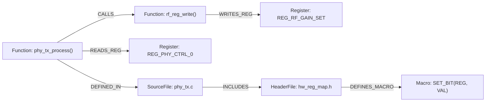

# Semantic CodeGraph Indexer using Clang Lib Tools and CLI

대규모 C/C++ 모바일 통신 프로토콜(PHY/MAC) 및 실시간 임베디드 소프트웨어의 복잡한 호출 계층과 하드웨어 제어 관계를 **Clang 컴파일러 정적 분석 엔진**으로 색인하는 **Semantic CodeGraph Indexer (Clang-CodeGraph)** 설계 및 구현 가이드입니다.

---

## 🎯 1. Clang-CodeGraph 정의 및 도입 배경

### 1.1 Clang-CodeGraph란?
**`Clang-CodeGraph`**는 C/C++ 대규모 코드베이스의 **AST(추상 구문 트리), 함수 호출 관계(Call Graph), 변수/심볼 참조 관계(Symbol References), 하드웨어 레지스터 맵 제어 경로, 헤더 의존성**을 Clang 컴파일러 엔진을 통해 정밀하게 파싱하여 지식 그래프(Knowledge Graph) 형태로 구조화하는 기술 및 아키텍처를 의미합니다.

특히 **모바일 통신 프로토콜 스택(PHY/MAC), 실시간 임베디드 SW, 레지스터 맵 제어** 도메인에서는 단순 텍스트 검색(`grep`)이나 경량 파서(`tree-sitter`)가 해결하지 못하는 전처리기 매크로(`#ifdef`, `#define`)와 타입 추론의 한계를 극복하는 **핵심 엔지니어링 솔루션**입니다.

### 1.2 왜 Tree-sitter가 아닌 Clang 기반 코드 그래프인가?

일반 웹/백엔드에서는 `tree-sitter` 기반의 빠른 정적 파싱으로 충분하지만, **C/C++ 임베디드 및 통신 프로토콜 SW에서는 Clang 기반이 필수적**입니다.

| 비교 항목 | Tree-sitter 기반 CodeGraph | Clang / LibTooling 기반 CodeGraph (필수) |
| :--- | :--- | :--- |
| **전처리기 (`#ifdef`, `#define`)** | 단순 토큰화만 수행, 조건부 컴파일 분기 해석 불가 | `compile_commands.json` 기반 실제 빌드 플래그에 맞추어 활성 코드 경로 완벽 분석 |
| **심볼 및 함수 오버로딩/타입 해석** | 단순 이름 매칭 (동일 함수명이 여러 개일 때 환각 발생) | 컴파일러 수준의 완전한 정적 타입 바인딩 및 정확한 Caller-Callee 매핑 |
| **하드웨어 레지스터 맵 / Struct 접근** | 구조체 포인터 역참조 및 비트필드(Bitfield) 추적 불가 | `volatile` 레지스터 주소 매핑, 비트마스크, 매크로 함수 호출 체인 정밀 추적 |
| **토큰 효율성 및 AI 에이전트 정확도** | 모호성으로 인해 불필요한 파일 전체를 읽어 **토큰 낭비** 발생 | 필요한 심볼의 1~2홉(Hop) 그래프만 정확히 슬라이싱하여 **토큰 80~90% 절감** |

---

## 🌐 2. 주요 오픈소스 프로젝트 및 생태계 동향

1. **`clangd-graph-rag` (GitHub: [`2015xli/clangd-graph-rag`](https://github.com/2015xli/clangd-graph-rag))**:
   - `clangd` LSP(Language Server Protocol) 및 Clang AST를 활용하여 C/C++ 프로젝트(Linux 커널, 대형 통신 모듈)를 **Neo4j 그래프 데이터베이스**에 인덱싱.
   - 관계망: `CALLS`, `INCLUDES`, `INHERITS`, `OVERRIDES`, `DEFINES`.
   - 목적: AI 에이전트가 단일 파일 검색을 넘어 *"이 인터럽트 핸들러에서 호출되어 공유 버퍼를 수정하는 모든 함수 경로"*를 단 한 번의 쿼리로 파악하도록 지원.
2. **`CodeScope` (Clang 17+ 기반 고성능 코드 그래프 엔진)**:
   - C++23 표준 지원 및 AI 에이전트를 위한 **MCP(Model Context Protocol) 서버** 내장.
   - 서브 밀리초(Sub-millisecond) 단위의 Call-Graph 질의를 통해 Cursor, Claude Code 등의 컨텍스트 주입 최적화.
3. **`codegraph` / `CodeGraphContext`**:
   - 로컬 코드베이스를 그래프 DB에 색인하고 MCP 도구(`get_callers`, `get_callees`, `find_references`)를 에이전트에게 제공하는 도구군.

---

## 🏛️ 3. 모바일 통신·임베디드 SW 추천 그래프 스키마 (Schema)

그룹의 **Active 2nd Brain**으로 활용하기 위해 설계할 수 있는 이상적인 임베디드 C/C++ 지식 그래프 모델입니다:



### 3.1 노드(Nodes) 명세
- **`Function`**: 함수명, 반환 타입, 인자 시그니처, Cyclomatic Complexity, 정의 파일 및 시작 라인.
- **`SourceFile` / `HeaderFile`**: 파일 절대/상대 경로, 포함된 모듈명.
- **`Struct` / `Union`**: 구조체 필드, 바이트 오프셋, 패킹/정렬 정보.
- **`Register` / `BitField`**: HW 레지스터 물리 주소, 비트 정의 (하드웨어 레지스터 맵 연계).
- **`Macro`**: 매크로 상수, 함수형 매크로 정의.

### 3.2 엣지(Edges) 명세
- **`CALLS`**: 함수 간 정적/동적 호출 관계 (호출 라인 번호 포함).
- **`READS_REG` / `WRITES_REG`**: 하드웨어 레지스터 및 비트필드 읽기/쓰기 제어 관계.
- **`MODIFIES_STATE`**: 글로벌 변수 또는 공용 메모리/DMA 버퍼 상태 변경.
- **`INCLUDES`**: 헤더 파일 포함 관계.
- **`DEFINES_MACRO`**: 헤더 내 매크로 정의 관계.

---

## 🚀 4. 사내 개발팀(Group 2nd Brain) 구축 4단계 엔지니어링 파이프라인

```
 [1. 빌드 DB 추출]
   - compile_commands.json 생성 (CMake, Bear, Ninja 등)
          │
          ▼
 [2. Clang AST 파싱 (LibTooling / libclang)]
   - AST RecursiveASTVisitor 실행
   - FunctionDecl, CallExpr, MemberExpr, MacroExpansions 수집
          │
          ▼
 [3. Graph DB 저장 (경량화 로컬 스택)]
   - Neo4j 또는 로컬 임베디드 그래프 DB (Kùzu / DuckDB Property Graph / SQLite)
   - 파일 간, 모듈 간 상호 연결 인덱스 생성
          │
          ▼
 [4. MCP Server & Agentic Loop 연동]
   - Claude / Cursor / Gemini 에이전트에게 get_call_chain, trace_hw_register MCP 도구 노출
   - 이슈 분석 및 코드 리뷰 시 필요한 1% 코드만 토큰 주입 ➡️ 속도 극대화 & 비용 80~90% 절감
```

---

## 💻 5. Phase 1: Compilation Database 생성 및 Clang CLI 명령어

### 5.1 `compile_commands.json` 생성 CLI

```bash
# 1) CMake 기반 프로젝트
cmake -B build -DCMAKE_EXPORT_COMPILE_COMMANDS=ON
cp build/compile_commands.json .

# 2) 레거시 Make / 독자 빌드 시스템 (Bear 도구 활용)
# 빌드 명령을 가로채 컴파일러 호출 플래그 자동 기록
bear -- make -j8

# 3) Ninja 빌드 시스템
ninja -t compdb > compile_commands.json
```

### 5.2 Clang CLI 분석 및 진단 도구

```bash
# 1. 헤더 포함 의존성 초고속 사전 스캔
clang-scan-deps -compilation-database=compile_commands.json -format=p1689

# 2. 대화형 AST 매처(Matcher) 테스트 (clang-query)
# 예: rf_write_reg 함수를 호출하는 모든 CallExpr 검출
clang-query -p compile_commands.json src/phy_tx.c
(clang-query) match callExpr(callee(functionDecl(hasName("rf_write_reg")))).bind("rf_call")

# 3. 특정 소스 파일의 AST 덤프 확인
clang-check -ast-dump --ast-dump-filter=phy_process src/phy_tx.c -p .
```

---

## ⚙️ 6. Phase 2: 시맨틱 인덱싱 핵심 (LibTooling AST Visitor)

Clang AST 노드 중 임베디드 및 프로토콜 분석에 필수적인 노드 매핑 정의입니다:

| Clang AST 노드 | 인덱서가 추출하는 시맨틱 정보 | 그래프 관계 (Edge) |
| :--- | :--- | :--- |
| `FunctionDecl` | 함수 정의/선언, 시그니처, 반환 타입, 가시성 | `(File)-[:DECLARES]->(Function)` |
| `CallExpr` | 정적/동적 함수 호출 지점, 인자 타입 | `(Function)-[:CALLS]->(Function)` |
| `MemberExpr` | 구조체/공용체 멤버 접근 (`struct->field`) | `(Function)-[:ACCESSES_REG]->(Field)` |
| `DeclRefExpr` | 전역/정적 변수 참조 (`volatile` 하드웨어 포인터) | `(Function)-[:REFERENCES]->(Variable)` |
| `BinaryOperator` | 대입문(`=`, `|=`, `&=`)으로 상태 변경 | `(Function)-[:MODIFIES]->(Symbol)` |

---

## 🐍 7. Phase 3: 파이썬 기반 실전 인덱서 스크립트

파이썬 환경에서 C++ 별도 빌드 없이 즉시 가동 가능한 [`semantic_codegraph_indexer.py`](file:///c:/Users/kihok/내%20드라이브/MyWiki/_sources/Study/Codebase-Understanding/Clang-CodeGraph/20260920/semantic_codegraph_indexer.py) 스크립트가 제공됩니다.

### 실행 방법:
```bash
# 의존성 설치
pip install libclang

# 단일 파일 또는 디렉토리 색인
python semantic_codegraph_indexer.py --src src/phy_driver.c --out codegraph.json

# 컴파일 데이터베이스 일괄 색인
python semantic_codegraph_indexer.py --db compile_commands.json --out codegraph.json
```

---

## 🗄️ 8. Phase 4: Graph-RAG 질의 시나리오 (Cypher)

인덱싱된 지식 그래프(Neo4j / Kùzu)를 기반으로 에이전트가 단 1회의 쿼리로 대답할 수 있는 핵심 질문들입니다:

### 8.1 하드웨어 레지스터 제어 경로 역추적 (Impact Analysis)
> *"RF Gain 레지스터(`REG_RF_GAIN_SET`)를 수정하는 모든 상위 프로토콜 진입점을 찾아라"*

```cypher
MATCH path = (caller:Function)-[:CALLS*1..4]->(driver:Function)-[:ACCESSES_REG]->(reg:HardwareRegisterField)
WHERE reg.name = 'REG_RF_GAIN_SET'
RETURN caller.name AS EntryPoint, 
       [n IN nodes(path) | n.name] AS CallChain,
       reg.name AS TargetRegister;
```

### 8.2 인터럽트 핸들러 영향도 분석
```cypher
MATCH (isr:Function {name: 'PHY_Rx_IRQHandler'})-[:CALLS*1..3]->(callee:Function)
OPTIONAL MATCH (callee)-[:ACCESSES_REG]->(reg)
RETURN isr.name, collect(DISTINCT callee.name) AS Subroutines, collect(DISTINCT reg.name) AS ModifiedRegisters;
```

---

## 🤖 9. Phase 5: Group 2nd Brain 연계 효과

1. **토큰 소모량 80~90% 절감**:
   - 수십 개 C 파일을 에이전트 컨텍스트에 전부 밀어 넣지 않고, 질의에 필요한 호출 경로와 레지스터 구조체(약 20~30줄)만 정확하게 슬라이싱하여 주입.
2. **환각(Hallucination) 제로화**:
   - 컴파일러가 입증한 실제 바인딩 정보만 전달하므로, 동일한 이름을 가진 다른 소스 파일의 더미 함수를 진짜 함수로 착각하는 문제 원천 방지.
3. **HW 스펙 변경 영향도 자동 산출**:
   - 칩 벤더의 HW 레지스터 오프셋이나 비트필드가 변경되었을 때, 수정해야 할 모든 C 드라이버 함수를 1초 만에 자동 리스트업.

---

## 🔗 연관 지식 및 내부 링크
- [[concepts/clang-codegraph|Clang 코드그래프 (Clang CodeGraph)]]
- [[concepts/semantic-codegraph-indexer|시맨틱 코드그래프 인덱서 (개념)]]
- [[concepts/embedded-software|임베디드 소프트웨어]]
- [[concepts/graph-rag|Graph-RAG]]
- [[concepts/mcp-server|MCP 서버]]
- [[concepts/active-second-brain|Active 2nd Brain]]
- [[_sources/Study/Codebase-Understanding/README|코드베이스 이해 스터디 아카이브]]
