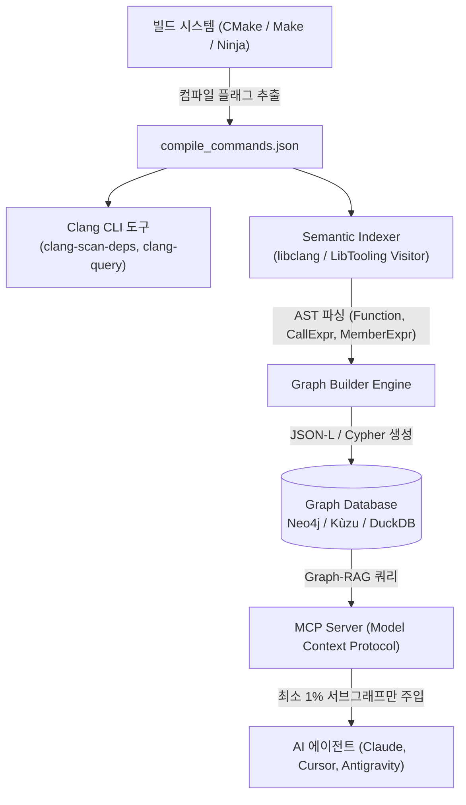

# Semantic CodeGraph Indexer using Clang Lib Tools and CLI

대규모 C/C++ 모바일 통신 프로토콜(PHY/MAC) 및 실시간 임베디드 소프트웨어의 복잡한 호출 계층과 하드웨어 제어 관계를 **Clang 컴파일러 정적 분석 엔진**으로 색인하는 **Semantic CodeGraph Indexer** 설계 및 구현 가이드입니다.

---

## 🎯 1. 도입 배경 및 핵심 과제

### 1.1 왜 기존 도구(Grep, Tree-sitter)로는 부족한가?
- **임베디드 C/C++ 환경의 특수성**:
  1. **전처리기 매크로 의존도**: `#ifdef`, `#define`, 조건부 컴파일 분기가 극도로 많음.
  2. **하드웨어 레지스터 맵 직접 제어**: 구조체 포인터 역참조(`pReg->CTRL.bit.ENABLE`), 비트필드 조작이 빈번함.
  3. **모호한 심볼 해석**: 단순 텍스트 매칭(`grep`)이나 구문 파서(`tree-sitter`)는 타입 바인딩과 헤더 검색 경로(`-I`, `-isystem`)를 알지 못해 수많은 동명 심볼에서 환각(Hallucination) 유발.
- **해결책**:
  - `compile_commands.json`을 기반으로 실제 빌드 플래그가 완벽히 주입되는 **Clang AST / LibTooling 엔진**을 사용하여 완전무결한 시맨틱 관계망을 추출.

---

## 🏛️ 2. 엔드투엔드 아키텍처 파이프라인



---

## 💻 3. Phase 1: Compilation Database 생성 및 Clang CLI 명령어

### 3.1 `compile_commands.json` 생성 CLI

```bash
# 1) CMake 기반 프로젝트
cmake -B build -DCMAKE_EXPORT_COMPILE_COMMANDS=ON
cp build/compile_commands.json .

# 2) 레거시 Make / 독자 빌드 시스템 (Bear 도구 활용)
# 빌드 명령을 가로채 컴파일러 호출 플래그 자동 기록
bear -- make -j8

# 3) Ninja 빌드 시스템
ninja -t compdb > compile_commands.json
```

### 3.2 Clang CLI 분석 및 진단 도구

```bash
# 1. 헤더 포함 의존성 초고속 사전 스캔
clang-scan-deps -compilation-database=compile_commands.json -format=p1689

# 2. 대화형 AST 매처(Matcher) 테스트 (clang-query)
# 예: rf_write_reg 함수를 호출하는 모든 CallExpr 검출
clang-query -p compile_commands.json src/phy_tx.c
(clang-query) match callExpr(callee(functionDecl(hasName("rf_write_reg")))).bind("rf_call")

# 3. 특정 소스 파일의 AST 덤프 확인
clang-check -ast-dump --ast-dump-filter=phy_process src/phy_tx.c -p .
```

---

## ⚙️ 4. Phase 2: 시맨틱 인덱싱 핵심 (LibTooling AST Visitor)

Clang AST 노드 중 임베디드 및 프로토콜 분석에 필수적인 노드 매핑 정의입니다:

| Clang AST 노드 | 인덱서가 추출하는 시맨틱 정보 | 그래프 관계 (Edge) |
| :--- | :--- | :--- |
| `FunctionDecl` | 함수 정의/선언, 시그니처, 반환 타입, 가시성 | `(File)-[:DECLARES]->(Function)` |
| `CallExpr` | 정적/동적 함수 호출 지점, 인자 타입 | `(Function)-[:CALLS]->(Function)` |
| `MemberExpr` | 구조체/공용체 멤버 접근 (`struct->field`) | `(Function)-[:ACCESSES_REG]->(Field)` |
| `DeclRefExpr` | 전역/정적 변수 참조 (`volatile` 하드웨어 포인터) | `(Function)-[:REFERENCES]->(Variable)` |
| `BinaryOperator` | 대입문(`=`, `|=`, `&=`)으로 상태 변경 | `(Function)-[:MODIFIES]->(Symbol)` |

---

## 🐍 5. Phase 3: 파이썬 기반 실전 인덱서 스크립트

파이썬 환경에서 C++ 별도 빌드 없이 즉시 가동 가능한 [`semantic_codegraph_indexer.py`](file:///c:/Users/kihok/내%20드라이브/MyWiki/_sources/Study/Codebase-Understanding/Clang-CodeGraph/20260920/semantic_codegraph_indexer.py) 스크립트가 제공됩니다.

### 실행 방법:
```bash
# 의존성 설치
pip install libclang

# 단일 파일 또는 디렉토리 색인
python semantic_codegraph_indexer.py --source src/phy_driver.c --output codegraph.json
```

---

## 🗄️ 6. Phase 4: Graph-RAG 질의 시나리오 (Cypher)

인덱싱된 지식 그래프(Neo4j / Kùzu)를 기반으로 에이전트가 단 1회의 쿼리로 대답할 수 있는 핵심 질문들입니다:

### 6.1 하드웨어 레지스터 제어 경로 역추적 (Impact Analysis)
> *"RF Gain 레지스터(`REG_RF_GAIN_SET`)를 수정하는 모든 상위 프로토콜 진입점을 찾아라"*

```cypher
MATCH path = (caller:Function)-[:CALLS*1..4]->(driver:Function)-[:ACCESSES_REG]->(reg:HardwareRegisterField)
WHERE reg.name = 'REG_RF_GAIN_SET'
RETURN caller.name AS EntryPoint, 
       [n IN nodes(path) | n.name] AS CallChain,
       reg.name AS TargetRegister;
```

### 6.2 인터럽트 핸들러 영향도 분석
```cypher
MATCH (isr:Function {name: 'PHY_Rx_IRQHandler'})-[:CALLS*1..3]->(callee:Function)
OPTIONAL MATCH (callee)-[:ACCESSES_REG]->(reg)
RETURN isr.name, collect(DISTINCT callee.name) AS Subroutines, collect(DISTINCT reg.name) AS ModifiedRegisters;
```

---

## 🤖 7. Phase 5: Group 2nd Brain 연계 효과

1. **토큰 소모량 80~90% 절감**:
   - 수십 개 C 파일을 에이전트 컨텍스트에 전부 밀어 넣지 않고, 질의에 필요한 호출 경로와 레지스터 구조체(약 20~30줄)만 정확하게 슬라이싱하여 주입.
2. **환각(Hallucination) 제로화**:
   - 컴파일러가 입증한 실제 바인딩 정보만 전달하므로, 동일한 이름을 가진 다른 소스 파일의 더미 함수를 진짜 함수로 착각하는 문제 원천 방지.
3. **HW 스펙 변경 영향도 자동 산출**:
   - 칩 벤더의 HW 레지스터 오프셋이나 비트필드가 변경되었을 때, 수정해야 할 모든 C 드라이버 함수를 1초 만에 자동 리스트업.

---

## 🔗 연관 지식 및 내부 링크
- [[concepts/semantic-codegraph-indexer|시맨틱 코드그래프 인덱서 (개념)]]
- [[concepts/embedded-software|임베디드 소프트웨어]]
- [[concepts/graph-rag|Graph-RAG]]
- [[concepts/mcp-server|MCP 서버]]
- [[_sources/Study/Codebase-Understanding/README|코드베이스 이해 스터디 아카이브]]
