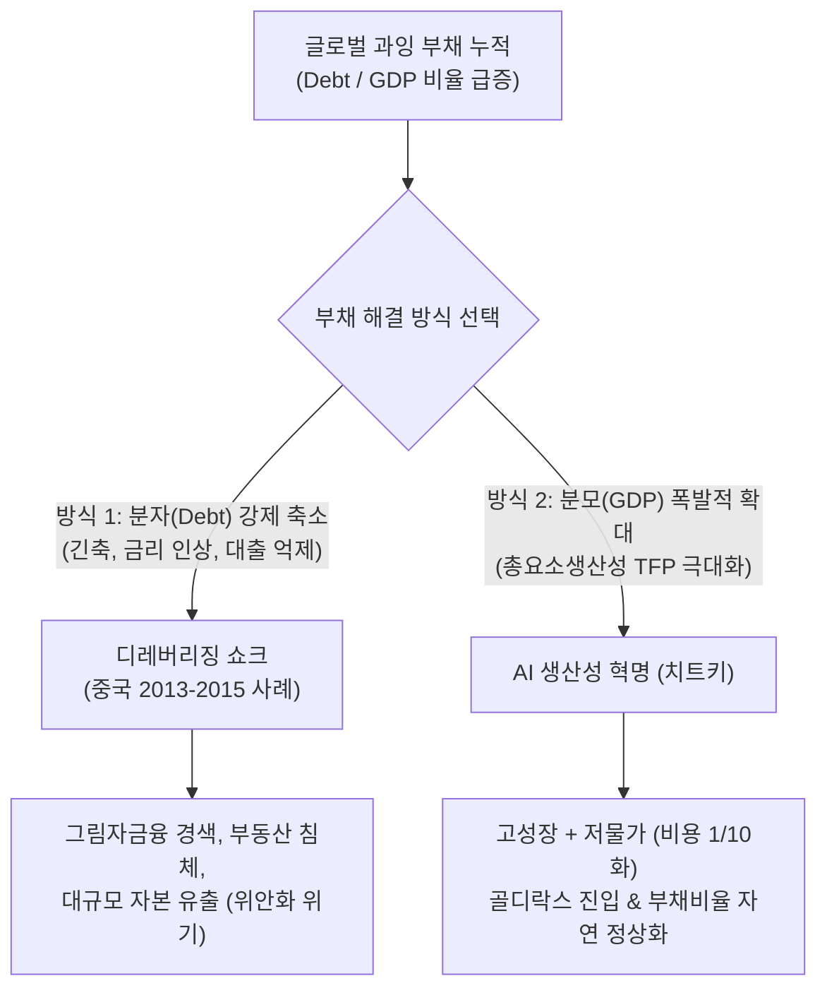

# AI 혁명이 실패하는 순간, 세계 경제는 흔들립니다 (오건영 단장 분석)

> **출처:** 삼프로TV 주말인터뷰  
> **출연:** 오건영 (신한은행 프리미어 패스파인더 단장 / 거시경제·자산배분 전문가)  
> **일자:** 2026년 9월 20일 기록  
> **영상 링크:** [YouTube 바로가기](https://www.youtube.com/watch?v=-5RvcnIFk18)

---

## Executive Summary (핵심 결론 및 거시경제 멘탈 모델)

1. **AI는 세계 경제의 유일한 '부채 해결 치트키' (Too Critical to Fail)**
   - 2008년 금융위기 및 팬데믹 이후 누적된 글로벌 국가부채(미국 부채 35조 달러 돌파)는 통상적인 긴축이나 증세로 해결 불가능.
   - **부채비율(Debt/GDP)을 낮추는 유일한 탈출구는 분모(GDP)의 폭발적 성장**.
   - AI 혁명이 성공하면: **초생산성 혁신 → 고성장 + 비용 절감(비용 1/10화 디플레이션) → 골디락스 실현**.
   - 반대로 AI가 캐즘(Chasm)에 갇히거나 ROI 회수에 실패할 경우: **저성장 + 고물가(구조적 인플레이션) + 고금리(스태그플레이션)**라는 최악의 조합 도래.

2. **야마니 패러독스(Yamani Paradox)와 반도체/Capex 사이클**
   - 1970년대 사우디 석유장관 야마니의 경고: *"석기시대가 끝난 것은 돌이 부족해서가 아니듯, 석유시대의 종말도 석유가 고갈되어서가 아니다."*
   - 원유 가격이 너무 높으면 대체 에너지 개발이 촉진되어 산유국의 지배력이 무너지듯, **AI 반도체 및 인프라 비용이 과도하게 높으면 빅테크는 자체 ASIC(NPU), 소프트웨어 효율화(양자화, 소형 LLM), 대체재 개발로 선회**.
   - 최근 SK 최태원 회장의 "반도체도 커모디티화 위험 대비" 발언과 일맥상통하는 기술적·경제적 임계점 도달.

3. **구조적 인플레이션과 '배송비 이론'**
   - 상품 본체 가격(자장면)이 문제가 아니라, 지정학적 분절화(호르무즈·홍해 리스크), 공급망 재편(니어쇼어링), 고령화로 인한 **유통·운송·안보 비용(배송비)이 구조적으로 상승**.
   - 이로 인해 과거와 같은 0%대 초저금리(ZIRP) 시대로의 회귀는 불가능하며, 중립금리($r^*$) 상향 고착화.

4. **자산배분 전략: 올인(All-in)을 경계하고 '바벨(Barbell) 전략' 구축**
   - AI 승자가 누가 될지 모르는 안개 속(Fog of War) 국면에서 특정 테크주 몰빵은 치명적 변동성 노출.
   - **바벨 포트폴리오**: 
     - 한 축: 끝까지 살아남아 승자독식할 최고 우량 AI 플랫폼/인프라 기업.
     - 반대 축: 고금리·인플레이션 장기화 및 지정학 충격 방어 자산(미국 중단기 국채, 금(Gold), 달러 현금 흐름).

---

## 1. AI 혁명과 글로벌 부채 딜레마: 왜 AI는 실패할 수 없는가?

### 1.1 부채 축소의 두 가지 경로 (중국 2013-2015년의 교훈)
오건영 단장은 글로벌 부채 문제를 설명하며 2013~2015년 중국의 부채 감축 시도를 결정적 사례로 제시함.



- **중국의 실패한 분자 줄이기 (2013~2015)**:
  - 부채를 줄이기 위해 금리를 올리고 신규 대출을 조이자, 지방정부 채무와 그림자금융이 연쇄 부도 위기에 직면.
  - 2015년 주가 폭락과 위안화 대규모 자본 유출 사태로 비화되어 결국 다시 돈을 풀 수밖에 없었음.
- **현대 경제의 불가역성**:
  - 현대 신용화폐 시스템에서 명목 부채를 강제로 회수하는 것은 전신 마비성 금융위기를 유발함.
  - 따라서 미국과 글로벌 경제가 천문학적 정부부채를 지고도 생존할 수 있는 유일한 길은 **'AI 생산성을 통한 분모(GDP) 키우기'**뿐임.

### 1.2 AI 성공 vs 실패 시나리오 매트릭스

| 구분 | 성과(Growth) | 물가(Inflation) | 금리(Interest Rate) | 경제적 귀결 |
| :--- | :--- | :--- | :--- | :--- |
| **AI 혁명 성공** | **초고성장 (High)** | **저물가 (Low)** | **적정 중립금리** | **골디락스(Goldilocks)**: 부채비율 급감, 기업 수익 극대화, 글로벌 생산성 재도약 |
| **AI 혁명 지연/실패** | **저성장 (Low)** | **고물가 (High)** | **고금리 (High)** | **스태그플레이션(Stagflation)**: 막대한 Capex 매몰, 국채 이자 부담 폭증, 글로벌 연쇄 부도 위기 |

---

## 2. 야마니 패러독스와 AI Capex 지속가능성

### 2.1 자키 야마니(Zaki Yamani)의 경고와 시사점
- 1970년대 제1·2차 석유파동 당시 사우디아라비아 석유장관 아흐메드 자키 야마니는 다른 OPEC 국가들이 유가를 끝없이 올리려 할 때 이를 강하게 경고함.
- **야마니의 논리**: 
  - *"석유 가격이 지나치게 폭등하면, 소비국들은 북해 유전, 알래스카 유전을 개발하고 원자력과 대체 에너지를 찾아 나설 것이며, 결국 석유의 전성기는 단축된다."*
- **현재 AI 및 반도체 산업과의 오버랩**:
  - 엔비디아 GPU 및 고대역폭 메모리(HBM)의 천문학적 가격과 마진율(70~80%)은 지속 가능한가?
  - 칩 가격과 데이터센터 전력 비용이 감내 수준을 넘어서면, 빅테크(구글, 메타, 마이크로소프트, 아마존)는:
    1. **자체 맞춤형 실리콘(ASIC/NPU)** 내재화 가속 (Google TPU, AWS Trainium, Meta MTIA).
    2. **알고리즘 효율화**: 거대 모델 대신 MoE(Mixture of Experts), 소형 온디바이스 모델(SLM), 양자화로 Compute 요구량 대폭 절감.
    3. **Capex 지출 속도 조절**: 인프라 투자 회수 기간(Payback Period) 지연 시 투자 감축 단행.

### 2.2 SK 최태원 회장 발언의 이면 (반도체 커모디티화 리스크)
- 최근 최태원 회장의 "반도체도 커모디티(Commodity)처럼 될 수 있다"는 발언은 야마니 패러독스와 정확히 부합.
- 초기 공급 부족 국면에서는 프리미엄 가격 결정권을 누리지만, 기술 표준화와 경쟁자 진입, 고객사의 자체 칩 채택이 늘어나면 공급 과잉과 마진 하락 압력에 직면하게 됨.

---

## 3. 구조적 인플레이션과 '배송비 이론'

### 3.1 짜장면 가격 vs 배송비 (공급망 비용의 구조적 변화)
오건영 단장은 일반인과 엔지니어가 인플레이션을 직관적으로 이해할 수 있는 탁월한 비유를 제시함:

> *"짜장면 가격이 10,000원인데 옛날 2,000원이던 배송비가 10,000원이 되었다면, 소비자가 체감하는 가격은 20,000원입니다. 짜장면(원자재) 가격이 내려가도 배송비(물류·안보·지정학 비용)가 내려오지 않으면 물가는 잡히지 않습니다."*

1. **지정학적 리스크의 상시화**:
   - 중동 분쟁(이란-이스라엘, 호르무즈 해협 위협), 홍해 후티 반군 공격으로 수에즈 운하 우회 항로(희망봉) 이용 → 운송 거리 급증, 보험료 및 용선료 폭등.
2. **탈세계화와 프렌드쇼어링(Friend-shoring)**:
   - 가장 값싼 국가(중국)에서 생산하던 효율 중심 체제에서, 동맹국 중심의 안전성 중심 체제로 전환 → 구조적 제조 단가 상승.
3. **인구 구조 변화**:
   - 베이비부머 은퇴 및 글로벌 생산인구 감소 → 구조적 임금 상승 압력.
- **결론**: 국제 유가나 원자재 가격이 단기 안정되더라도, **기저에 깔린 운송·인건비·지정학 안보 비용이 고착화되어 과거 저물가 시대로 복귀 불가능**.

---

## 4. 환율(FX) 시장의 구조적 변화: 원/달러 1,400원 뉴노멀

### 4.1 환율 바닥(Floor)의 계단식 상승
- 과거 원/달러 환율의 심리적 저항선: 1,100원 → 1,200원.
- 현재 환율 환경: 환율이 1,350원 수준으로만 내려와도 강력한 결제 수요와 해외 투자 수요(서학개미, 연기금 등)가 유입되며 하단을 지지.
- **환율 하단이 상향 고착화된 이유**:
  1. 미국과의 구조적 기준금리 격차 (미국 5%대 vs 한국 3%대).
  2. 국내 자본의 해외 자산(미국 주식/채권) 유출 구조 심화.
  3. 무역 흑자 구조의 질적 약화 (대중국 무역수지 적자 전환 등).

### 4.2 엔화(JPY)와 엔 캐리 트레이드(Yen Carry Trade) 리스크
- 일본은행(BOJ)의 마이너스 금리 종료 및 YCC(수익률곡선제어) 철폐로 미·일 금리차 축소 압력 발생.
- 엔화 급등 시 전 세계 금융시장에 레버리지로 뿌려졌던 엔 캐리 자금이 급격히 회수되며 글로벌 자산 시장(특히 테크주)에 단기 유동성 발작 유발.

---

## 5. 실전 자산배분: 불확실성의 안개(Fog of War)를 뚫는 바벨 전략

```
                 [전략적 자산배분: Barbell Portfolio]
                 
    [공격 자산: 성장 추구]                           [방어 자산: 리스크 헤지]
  ┌─────────────────────────┐                     ┌─────────────────────────┐
  │  글로벌 1등 AI 플랫폼     │                     │  미국 단기/중기 국채     │
  │  (독점적 해자 & 현금흐름) │                     │  (연 4~5% 무위험 수익)   │
  │  빅테크 메가캡 주식       │                     │  골드(Gold, 화폐가치 헷지)│
  │  (소프트웨어/데이터 리더)  │                     │  달러 현금성 자산        │
  └─────────────────────────┘                     └─────────────────────────┘
              ▲                                               ▲
              └─────────────── [중도 분산 / 리밸런싱] ─────────┘
```

1. **승자 예측 몰빵(Single-bet) 지양**:
   - 인터넷 초창기 시스코(Cisco), 야후(Yahoo)처럼 인프라 초기 주도주가 최종 플랫폼 승자가 되지 못한 역사적 사례 다수.
   - 현 시점의 GPU/인프라 칩 제조사가 미래 AI 서비스 생태계의 최종 이익을 독식할 것인지, 아니면 최종 애플리케이션 플랫폼(빅테크)이 가져갈 것인지는 미지수.
2. **바벨 전략의 핵심 원칙**:
   - **한쪽 극단 (High Growth)**: AI 혁명의 실질적 수혜를 보며 막대한 잉여현금흐름(FCF)을 창출하는 초일류 빅테크 기업.
   - **다른 쪽 극단 (Safe-Haven Yield)**: 높은 금리를 확정적으로 수취할 수 있는 미국 단기 국채 및 중앙은행들의 탈달러화 수요를 흡수하는 금(Gold).
   - 변동성 확대 국면마다 리밸런싱(Rebalancing)을 통해 저가 매수 및 고점 분할 매도 자동화.

---

## 6. 엔지니어링 리더(Group Leader) 관점의 시사점

> **Persona Focus:** Mobile SW Protocol / Physical Layer Embedded SW / HW-SW Co-design 리더

1. **하드웨어 제약 기반의 AI 알고리즘 경량화(Edge AI / On-Device AI) 기술 가치 폭등**:
   - 빅테크의 Capex 부담과 데이터센터 전력/발열 한계로 인해, 거대 서버 의존형 AI에서 **엣지(단말) 단에서 실시간 프로토콜 및 신호처리를 최적화하는 온디바이스 AI/NPU 기술의 전략적 중요성**이 비약적으로 증가함.
2. **모바일 통신 프로토콜 & 레지스터 맵 기반 지능화**:
   - PHY/MAC 레이어의 방대한 파라미터 튜닝과 레지스터 맵 제어에 소형 특화 LLM/에이전트를 접목하여, 전력 소모를 획기적으로 낮추는 HW-SW Co-design 역량이 향후 제품 상용화의 핵심 경쟁력으로 부상할 것.
3. **거시경제 리스크와 R&D 로드맵의 동기화**:
   - 무조건적인 고비용 GPU 서버 확충보다는, 기존 레거시 코드베이스의 AST/Symbol 분석 기반 AI 효율화 및 로컬 최적화 파이프라인 구축이 조직의 비용 효율성을 방어하는 핵심 열쇠.

---

## 🔗 연관 지식 및 내부 링크
- [[concepts/yamani-paradox|야마니 패러독스 (Yamani Paradox)]]
- [[concepts/barbell-strategy|바벨 전략 (Barbell Strategy)]]
- [[entities/oh-gun-young|오건영 단장 인물 프로필]]
- [[concepts/vibe-coding|바이브 코딩 (Vibe Coding)]]
- [[concepts/NewsSummarizer-Architecture|NewsSummarizer 아키텍처]]
- [[lecture_report.html]]: 오건영 단장 인터뷰 반응형 인터랙티브 HTML 대시보드 리포트
