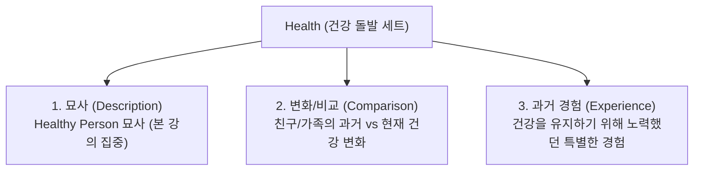

# 오픽 건강 돌발 주제: 표현 & 답변 구조 총정리 (해커스 클로이)

> **출처:** 해커스TV 유튜브 최신 오픽 기출유형특강  
> **강사:** 해커스어학원 종로캠퍼스 클로이(Chloe) 선생님  
> **학습 일자:** 2026년 9월 20일  
> **영상 링크:** [YouTube 바로가기](https://www.youtube.com/watch?v=IKZowWrcaog)  
> **자료집 파일:** [해커스영어_클로이_7월_오픽기출유형특강_자료집.pdf](file:///c:/Users/kihok/내%20드라이브/MyWiki/_sources/Study/Opic/클로이/20260920/해커스영어_클로이_7월_오픽기출유형특강_자료집.pdf)  
> **인터랙티브 대시보드:** [opic_study_dashboard.html](file:///c:/Users/kihok/내%20드라이브/MyWiki/_sources/Study/Opic/클로이/20260920/opic_study_dashboard.html)

---

## 🎯 1. OPIc 건강(Health) 돌발 주제 기출 분석

오픽 시험에서 **건강(Health)**은 서베이 선택과 무관하게 갑자기 출제되는 대표적인 **'돌발 주제(Surprise Topic)'**입니다.  
통상적으로 3단 콤보 질문으로 묶여서 출제됩니다.



- **본 강의 집중 유형:** **1번 묘사 (Healthy Person 묘사)**
- **핵심 특징:**
  - **시제:** 일반적인 사실과 현재 상태를 설명하므로 **현재 시제(Present Tense)**를 기본으로 사용.
  - **발화 시간:** 1분 초반(약 1분 ~ 1분 15초) 내외가 가장 이상적임.

---

## 🎧 2. 실전 질문 (Question) & 청취(Listening) 전략

### 2.1 질문 원문 및 해석

> **Q. Tell me about a healthy person you know. What does he or she look like? What kinds of food does this person usually eat? Please give me as many details as possible.**  
> *(당신이 알고 있는 건강한 사람에 대해 말해주세요. 그 사람의 외모나 체형은 어떻게 생겼나요? 그 사람은 주로 어떤 종류의 음식을 먹나요? 가능한 한 자세한 이야기를 들려주세요.)*

### 2.2 클로이쌤의 실전 청취 2회 전략

시험장에서 에바(Eva)의 질문은 **반드시 리플레이(Replay) 버튼을 눌러 2번 청취**해야 합니다:

1. **첫 번째 들을 때 (1st Listening):**
   - 질문의 **'유형(Type)'**이 무엇인지 신속하게 파악합니다.
   - *"Tell me about a person you know..."* ➡️ **인물 묘사 유형**임을 즉각 인지. (뒤에 딸려 나오는 '무슨 음식 먹냐', '어떻게 생겼냐'는 답변을 돕는 가이드성 질문임)
2. **두 번째 들을 때 (2nd Listening):**
   - **MBC 프레임워크**로 답변의 핵심 뼈대(키워드)를 머릿속으로 빠르게 브레인스토밍합니다.
   - `M`: 친구 이름 정하기 (Joy)
   - `B`: 3단 덩어리 구상 (1. 몸매: lean & muscular ➡️ 2. 음식: green salad ➡️ 3. 운동: gym 1 hour)
   - `C`: 결론 마무리 (She's definitely the healthiest friend)

---

## 🏛️ 3. MBC 답변 구조화 프레임워크

단순 암기식 줄글 답변은 시험장에서 막히기 쉽습니다. **생각의 흐름 3단계(MBC)**로 접근해야 자연스러운 고득점이 가능합니다.

```
┌────────────────────────────────────────────────────────────────────────┐
│ M (Main Idea): 대상/이름 즉시 제시                                      │
│  - 내가 아는 사람 중 가장 건강한 사람으로 친구 Joy 지목                  │
├────────────────────────────────────────────────────────────────────────┤
│ B (Body): 생각의 흐름 3단 덩어리 전개                                  │
│  - 덩어리 1 (체형/외모): 이상적인 체형, 군살 없고 탄탄한 근육질 (lean)    │
│  - 덩어리 2 (식습관): 신선한 채소와 닭가슴살, 매일 즐겨 먹음           │
│  - 덩어리 3 (운동 습관): 바빠도 헬스장 절대 안 빠짐, 매일 1시간 운동    │
├────────────────────────────────────────────────────────────────────────┤
│ C (Conclusion): 최종 요약 및 강조                                       │
│  - 어쨌든 조이는 내가 아는 가장 건강한 친구임이 확실함                  │
└────────────────────────────────────────────────────────────────────────┘
```

---

## 💡 4. 필수 체형 & 건강 어휘 (Key Expressions)

외모와 체형을 묘사할 때 반드시 알아두어야 할 핵심 형용사 10선입니다. 단순한 `thin`, `fat` 같은 표현 대신 오픽 채점관이 선호하는 풍부한 어휘를 구사해야 합니다.

| 영단어 (Word) | 의미 (Meaning) | 뉘앙스 및 실전 발화 팁 (Nuance & Tip) |
| :--- | :--- | :--- |
| **lean** | 군살 없는, 탄탄한 | 기름기 없이 날렵하고 탄탄한 건강미를 나타낼 때 최고의 찬사. (*lean and muscular*) |
| **muscular** | 근육질의 | 발음 주의: `[mʌ́skjulər]`. 운동을 많이 한 탄탄한 근육형 몸매에 사용. |
| **fit** | 건강하게 몸이 좋은 | 운동으로 균형 잡히고 체력이 좋은 상태. (*keep fit, stay fit*) |
| **athletic** | 운동선수 같은 체형의 | 어깨가 넓거나 탄탄하고 날렵한 스포츠 체형. |
| **slender** | 날씬하고 매력적인 | 가늘고 보기 좋게 날씬한 체형. (호감형 뉘앙스) |
| **slim** | 날씬한, 호리호리한 | 군살 없이 슬림한 체형. |
| **skinny** | 앙상하게 마른 | **주의:** 다소 뼈만 남고 왜소한 부정적(Negative) 뉘앙스가 있을 수 있음. |
| **stocky** | 다부진, 체격이 좋은 | 키는 크지 않더라도 어깨와 상체가 다부지고 단단한 체격. |
| **chubby** | 통통한, 살집이 있는 | 귀엽게 볼살이 있거나 통통한 상태. (과거-현재 비교 질문에서 *"I used to be chubby"* 로 유용) |
| **overweight** | 과체중의 | `fat` 대신 격식 있고 객관적으로 체중 초과를 표현하는 매너 단어. |

---

## 🗣️ 5. 실전 모범 답변 (Model Answer Script)

### 5.1 통합 스크립트 (English Full Script)

> **[M]**  
> Um... I have quite a lot of friends, but you know, Joy is **one of the healthiest people I've ever known**.  
> 
> **[B - 1. 체형]**  
> You know, she has a pretty **ideal body shape**.  
> She's **lean and muscular**, you know.  
> 
> **[B - 2. 음식]**  
> And you know what? She always eats **something green, like salads with chicken breast**.  
> It's pretty interesting because she actually **enjoys eating healthy food** every single day.  
> 
> **[B - 3. 운동]**  
> And I'd say her **biggest secret to maintaining her healthy body is** working out.  
> Even though she is **quite busy with work and studying**, she **never skips the gym**.  
> She works out there for about **like an hour every day**. Yeah, she's **amazing**.  
> 
> **[C]**  
> Anyway, yeah, Joy is definitely **the healthiest friend I know**.

---

### 5.2 섹션별 상세 분석 및 발화 포인트

#### [M - Main Idea] 도입 및 대상 제시
- **스크립트:** `Um... I have quite a lot of friends, but you know, Joy is one of the healthiest people I've ever known.`
- **해석:** 음... 제가 친구가 꽤 많은 편인데요, 조이라는 친구가 제가 지금까지 알아온 사람 중 가장 건강한 사람 중 하나예요.
- **발화 팁:**
  - 첫마디에 바로 로봇처럼 튀어나오면 외운 티가 납니다. `Um...` 하고 잠깐 뜸을 들이며 자연스럽게 시작하세요.
  - 패턴 암기: `one of the + 최상급 + 복수명사 (+ I've ever known)` ➡️ AL 달성을 위한 대표적인 복합 구문.
  - 조금 더 쉽게 발화하려면: `Joy is the healthiest person I know.` 로 변형 가능.

#### [B - Body 1] 체형 묘사
- **스크립트:** `You know, she has a pretty ideal body shape. She's lean and muscular, you know.`
- **해석:** 있잖아요, 그 친구는 체형이 정말 이상적이거든요. 군살 없이 탄탄하고 근육질이에요, 아시죠?
- **발화 팁:**
  - `pretty`는 '예쁜'이 아니라 부사 '꽤, 정말(very)'로 사용되어 원어민스러운 톤을 만듭니다.
  - `lean and muscular`를 한 호흡에 붙여서 강세를 주며 발화합니다.

#### [B - Body 2] 식습관 묘사 (Fact + Feeling)
- **스크립트:** `And you know what? She always eats something green, like salads with chicken breast. It's pretty interesting because she actually enjoys eating healthy food every single day.`
- **해석:** 그리고 그거 아세요? 그 친구는 닭가슴살 샐러드처럼 항상 초록색 야채 위주로 먹어요. 신기한 게 뭐냐면, 매일매일 건강식을 먹는 걸 진심으로 즐기더라고요.
- **발화 팁:**
  - **화제 전환 필러:** `And you know what?` (이거 아세요?)로 주의 집중.
  - **Fact + Feeling 기법:** 단순히 *"샐러드 먹는다"*에서 끝내지 않고, *"그게 참 신기하고 대단하다(It's pretty interesting because...)"*는 나의 감정을 덧붙여 발화 분량과 유창성을 2배로 확장.
  - 닭가슴살 발음: `chicken breast` [tʃíkən brest].

#### [B - Body 3] 운동 습관 및 비결
- **스크립트:** `And I'd say her biggest secret to maintaining her healthy body is working out. Even though she is quite busy with work and studying, she never skips the gym. She works out there for about like an hour every day. Yeah, she's amazing.`
- **해석:** 그리고 건강한 몸을 유지하는 가장 큰 비결은 운동인 것 같아요. 일하고 공부하느라 꽤 바쁜데도 불구하고, 헬스장을 절대 빼먹지 않거든요. 매일 거기서 한 시간 정도 운동을 해요. 정말 대단해요.
- **발화 팁:**
  - 생각 표현 다변화: `I think` 대신 `I'd say`, `I guess` 활용.
  - 복합 접속사: `Even though she is busy with ~` (비록 ~하느라 바쁠지라도).
  - 유용한 표현: `never skips the gym` (헬스장/운동을 절대 거르지 않는다).
  - 숫자 앞 뜸들이기: `for about like an hour` — 숫자를 말할 때 살짝 기억을 더듬는 척하면 매우 자연스러운 네이티브 발화로 채점됨.

#### [C - Conclusion] 마무리 정리
- **스크립트:** `Anyway, yeah, Joy is definitely the healthiest friend I know.`
- **해석:** 어쨌든 간에, 조이는 제가 아는 사람 중에 가장 건강한 친구임이 확실해요.
- **발화 팁:**
  - 마무리 시그널: `Anyway, yeah...` 로 답변을 끝맺음하겠다는 명확한 신호 전달.
  - `definitely`에 확실한 악센트를 주어 설득력 있게 마감.

---

## 🌟 6. IH vs AL 등급 가르는 실전 팁

| 구분 | IM 목표 수험생 | IH / AL 목표 수험생 (클로이쌤 권장) |
| :--- | :--- | :--- |
| **시작 구문** | *My friend Joy is very healthy.* | *Um... I have quite a lot of friends, but you know, Joy is one of the healthiest people I've ever known.* |
| **문장 구조** | 단순 단문 나열 (*She eats salad. She goes to gym.*) | 접속사 결합 복문 (*Even though she's busy..., she never skips...*) |
| **내용 전개** | 팩트만 나열하고 침묵 발생 | **Fact + Feeling 결합** (팩트 뒤에 *It's pretty interesting*, *She's amazing* 등 감정 추가) |
| **어휘 수준** | *skinny, fat, good* | *lean, muscular, ideal body shape, maintain healthy body* |
| **필러 & 리듬** | 한국식 머뭇거림(어... 음...) 또는 기계적 암기 발화 | *You know, You know what?, I'd say, for about like...* 자연스러운 추론 연기 |

---

## 📸 7. 강의 슬라이드 인덱스

강의 자료집 핵심 슬라이드 원본 이미지:
- [슬라이드 1 — 오픽 기출유형 분석집 표지](file:///c:/Users/kihok/내%20드라이브/MyWiki/_sources/Study/Opic/클로이/20260920/slides/page_1.png)
- [슬라이드 2 — 건강 돌발 기출분석 & 질문 원문](file:///c:/Users/kihok/내%20드라이브/MyWiki/_sources/Study/Opic/클로이/20260920/slides/page_2.png)
- [슬라이드 3 — 필수 체형 어휘 10선 & MBC 플롯](file:///c:/Users/kihok/내%20드라이브/MyWiki/_sources/Study/Opic/클로이/20260920/slides/page_3.png)
- [슬라이드 4 — 모범 답변 컬러 스크립트 (강조 구문)](file:///c:/Users/kihok/내%20드라이브/MyWiki/_sources/Study/Opic/클로이/20260920/slides/page_4.png)
- [슬라이드 5 — 실전 섀도잉 클린 스크립트](file:///c:/Users/kihok/내%20드라이브/MyWiki/_sources/Study/Opic/클로이/20260920/slides/page_5.png)

---

## 🔗 연관 지식 및 내부 링크
- [[_sources/Study/Opic/README|OPIc 스터디 메인 인덱스]]
- [[_sources/Study/Opic/클로이/README|해커스 클로이 강의 아카이브]]
- [인터랙티브 발화 훈련 대시보드 (HTML)](file:///c:/Users/kihok/내%20드라이브/MyWiki/_sources/Study/Opic/클로이/20260920/opic_study_dashboard.html)
