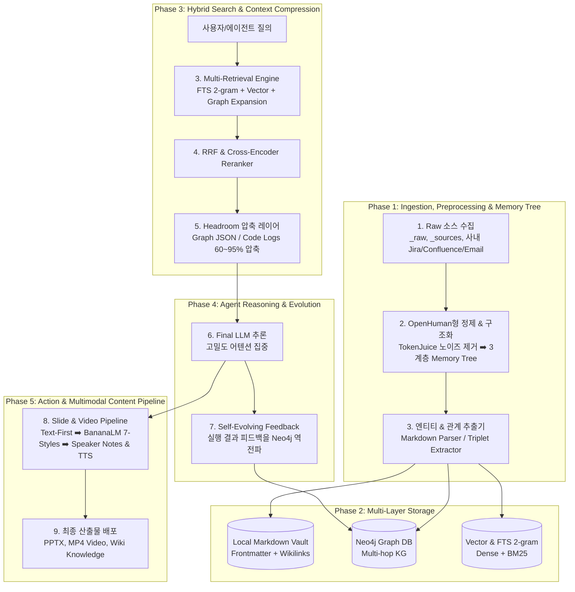

# 🧠 2nd Brain System Design Blueprint (세컨드 브레인 시스템 설계 청사진)

본 문서는 개인용 에이전틱 볼트(Personal Agentic Vault) 및 엔터프라이즈 그룹 세컨드 브레인(Group 2nd Brain)을 실제 시스템으로 구현할 때, **설계(Design) 단계에서 반드시 반영해야 하는 핵심 모듈별 상세 설계 가이드와 아키텍처 청사진**을 정의합니다.

---

## 🏛️ 전체 5단계 시스템 설계 라이프사이클

---

## 🛠️ 모듈별 상세 설계 명세 (Design Specifications)

### 1. 검색 및 컨텍스트 최적화 설계 (Retrieval & Compression Layer)

#### [설계 1.1] 4계층 하이브리드 검색 엔진 (Multi-Retrieval)
- **설계 위치:** 에이전트 질의 처리기 및 RAG 검색 모듈 (`core/retrieval`)
- **설계 명세:**
  1. **1차 검색 (High Recall):**
     - **FTS 2-gram (unicode61):** C/C++ 심볼, Lint 룰 코드(예: `CDC_CLK_001`), 한국어 형태소 고유명사를 100% 매칭.
     - **Dense Vector Search:** 의미론적 개념 및 자연어 질의 유사도 검색.
     - **Neo4j Graph Expansion:** 엔티티 간 2-hop / 3-hop 인과 관계 및 종속성 그래프 탐색.
  2. **2차 정렬 (High Precision):**
     - **RRF (Reciprocal Rank Fusion):** 세 검색기의 순위를 표준 공식($RRF\_Score = \sum \frac{1}{60 + rank}$)으로 정규화 합산.
     - **Cross-Encoder Reranker (bge-reranker-large / Cohere):** 상위 50~100개 후보군을 질의와 교차 검증하여 최종 Top-5~10 선별.

#### [설계 1.2] Headroom 컨텍스트 압축 레이어 (Context Optimizer)
- **설계 위치:** Reranker 출력단과 Final LLM 프롬프트 주입구 사이 (`core/compression`)
- **설계 명세:**
  1. **Graph JSON 정제:** Neo4j에서 반환된 거대한 노드/엣지 속성 JSON에서 문법적 보일러플레이트를 제거하고 압축 튜플(`(NodeA)-[REL]->(NodeB)`)로 변환 (토큰 70~90% 절감).
  2. **도구 로그 압축:** `run_command`, `grep`, `git diff`의 불필요한 공백과 중복 헤더를 축약하여 에이전트 컨텍스트 비대증(Bloat) 원천 차단.
  3. **어텐션 밀도 극대화:** 정답과 무관한 노이즈 청크를 제거해 LLM이 핵심 증거(Top Evidence)에 100% 주의력을 집중(Lost in the middle 방지)하도록 보장.

---

### 2. 출력 및 멀티모달 콘텐츠 파이프라인 설계 (Downstream Action Layer)

#### [설계 2.1] 13단계 E2E 슬라이드 & 영상 제작 파이프라인
- **설계 위치:** 지식 산출물 배포 및 에이전트 액션 모듈 (`skills/slide-video-pipeline`)
- **설계 원칙 (First Principle):**
  > **"슬라이드와 영상을 만들기 전에, 반드시 완성형 텍스트와 스토리라인을 먼저 확립한다."**
- **설계 명세:**
  1. **자료 수집 및 소스 그라운딩 (NotebookLM 연계):** 신뢰할 수 있는 소스 문서에서 사실(Fact)을 추출하여 환각 배제.
  2. **슬라이드별 분할 및 발표자 메모(Speaker Notes) 생성:**
     - 슬라이드당 최대 5개 정보 블록 제한(가독성 보장).
     - **발표자 메모 칸에 Google Vids / AI TTS가 읽을 구어체 대본(2~4문장)을 필수 탑재.**
  3. **7대 BananaLM 스타일 엔진 탑재:**
     - Memphis Flat Corporate, Cyberpunk Neon Dark, Swiss Minimal, Warm Editorial, Glassmorphism, Neo-Brutalism, Executive Navy & Gold 중 선택적 렌더링.
  4. **포맷 변환:** PPTX 내보내기 ➡️ Google Vids 프로젝트 로드 ➡️ AI 보이스 매칭 ➡️ 최종 MP4 비디오 렌더링.

---

### 3. 지식 거버넌스 및 다층 승격 설계 (Data Governance Tier)

#### [설계 3.1] Multi-Tier 지식 승격 프로토콜
- **설계 위치:** 볼트 동기화 및 PII 필터링 모듈
- **계층 구분:**
  - **Personal Tier (로컬 단독):** 개인 메모, 원본 초안 (`_raw/`), 비공개 아이디어.
  - **Team Tier (그룹 공유):** PII(개인식별정보) 자동 마스킹 및 휴먼 승인(Human-on-the-loop)을 거쳐 팀 Neo4j 및 위키로 승격.
  - **Enterprise Tier (전사 표준):** 검증된 아키텍처 및 전사 가이드라인.

#### [설계 3.2] 자가 진화 루프 (Self-Evolving Loop)
- 에이전트가 코드를 실행하거나 지식을 검색한 후, **"성공/실패 여부"와 "사용자 교정 피드백"을 Neo4j의 엣지 가중치(Confidence Score)로 역전파(Back-propagation)**하여 모델 재학습 없이도 영구적으로 정확도를 향상시킴.

---

## 📋 향후 시스템 구현 시 Revisit 체크리스트

시스템 구축 단계로 진입할 때 다음 체크리스트를 순서대로 점검합니다:

- [ ] **0. Ingestion Layer:** 사내 Jira/Confluence/Exchange 연동을 위한 OpenHuman 패턴(20분 주기 Auto-fetch + TokenJuice 노이즈 필터링 + 3계층 Memory Tree + 사내 PAT) 데몬 구축.
- [ ] **1. Storage Layer:** Local Markdown(`MyWiki`)과 Neo4j Graph DB(`KG-MCP`) 간 양방향 동기화 데몬 설정.
- [ ] **2. Retrieval Core:** SQLite FTS5 2-gram 인덱스 + Vector DB + Neo4j Cypher 쿼리 파이프라인 결합.
- [ ] **3. Compression Hook:** Headroom Python 라이브러리 / MCP Proxy를 Reranker 출력단에 배치.
- [ ] **4. Action Skills:** `slide-video-pipeline`을 호출해 지식 문서를 7대 BananaLM 스타일 슬라이드 및 Google Vids 영상으로 즉시 변환 테스트.
- [ ] **5. Feedback Logger:** 사용자 피드백을 수집하여 Graph DB 노드 신뢰도를 갱신하는 Reflection 루프 활성화.

---

## 🔗 관련 개념 및 문서
- [[concepts/active-second-brain]]
- [[concepts/graph-rag]]
- [[concepts/multi-tier-knowledge-architecture]]
- [[concepts/wiki-layer-architecture]]
- [[concepts/context-compression]]
- [[concepts/slide-video-workflow]]
- [[skills/slide-video-pipeline]]
- [[entities/openhuman]]
- [[entities/firefly-iii]]
- [[entities/ecc]]
- [[entities/headroom]]
- [[entities/neo4j]]
- [[entities/notebooklm]]
- [[entities/google-vids]]
