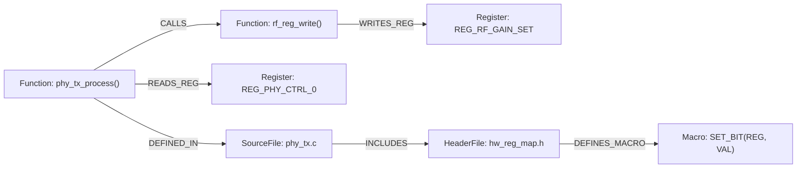

# Clang 코드그래프 (Clang CodeGraph)

**Clang-CodeGraph**는 C/C++ 대규모 코드베이스의 **추상 구문 트리(AST), 함수 호출 관계(Call Graph), 심볼/변수 참조 관계, 하드웨어 레지스터 맵 제어 경로, 헤더 의존성**을 Clang 컴파일러 엔진을 통해 정밀하게 파싱하여 지식 그래프(Knowledge Graph) 형태로 구조화하는 기술입니다.

특히 **모바일 통신 프로토콜 스택(PHY/MAC), 실시간 임베디드 SW, 레지스터 맵 제어** 환경에서는 단순 텍스트 검색(`grep`)이나 경량 파서(`tree-sitter`)가 처리하지 못하는 조건부 전처리기 매크로(`#ifdef`, `#define`)와 타입 바인딩의 한계를 해결하는 **핵심 엔지니어링 솔루션**입니다.

---

## ⚖️ Tree-sitter vs Clang 기반 CodeGraph 비교

| 비교 항목 | Tree-sitter 기반 CodeGraph | Clang / LibTooling 기반 CodeGraph (필수) |
| :--- | :--- | :--- |
| **전처리기 (`#ifdef`, `#define`)** | 단순 구문 분석만 수행, 활성 컴파일 분기 해석 불가 | `compile_commands.json` 기반 실제 빌드 플래그에 맞춘 정확한 코드 경로 분석 |
| **심볼 및 함수 오버로딩/타입 해석** | 단순 이름 매칭 (동일 함수명이 여러 개일 때 환각 발생) | 컴파일러 수준의 완전한 정적 타입 바인딩 및 무환각 Caller-Callee 매핑 |
| **하드웨어 레지스터 맵 / Struct 접근** | 구조체 포인터 역참조 및 비트필드(Bitfield) 추적 불가 | `volatile` 레지스터 주소 매핑, 비트마스크, 매크로 함수 호출 체인 정밀 추적 |
| **토큰 효율성 및 AI 에이전트 정확도** | 모호성으로 인해 불필요한 파일 전체를 읽어 **토큰 낭비** 발생 | 필요한 심볼의 1~2홉(Hop) 서브그래프만 정확히 슬라이싱하여 **토큰 80~90% 절감** |

---

## 🏛️ 추천 그래프 스키마 (Graph Schema)



### 핵심 노드 & 엣지 정의
- **노드 (Nodes)**:
  - `Function`: 함수명, 반환 타입, 인자 시그니처, Cyclomatic Complexity
  - `SourceFile` / `HeaderFile`: 파일 경로, 소속 모듈명
  - `Struct` / `Union`: 구조체 필드, 오프셋, 패킹 정보
  - `Register` / `BitField`: HW 레지스터 물리 주소, 비트 정의 (레지스터 맵)
  - `Macro`: 매크로 상수, 매크로 함수
- **엣지 (Edges)**:
  - `CALLS`: 호출 관계
  - `READS_REG` / `WRITES_REG`: 하드웨어 레지스터 제어 관계
  - `MODIFIES_STATE`: 글로벌 변수 또는 공용 메모리 버퍼 상태 변경
  - `INCLUDES`: 헤더 포함 관계

---

## 🌐 주요 오픈소스 생태계

1. **`clangd-graph-rag` (GitHub: [`2015xli/clangd-graph-rag`](https://github.com/2015xli/clangd-graph-rag))**:
   - `clangd` LSP 및 Clang AST를 활용하여 C/C++ 프로젝트를 **Neo4j 그래프 데이터베이스**에 인덱싱.
   - 관계망: `CALLS`, `INCLUDES`, `INHERITS`, `OVERRIDES`, `DEFINES`.
2. **`CodeScope`**:
   - Clang 17+ 기반 고성능 C++23 코드 그래프 엔진. 내장 **MCP 서버**를 통해 AI 에이전트(Cursor, Claude Code)에게 서브 밀리초 Call-Graph 컨텍스트 제공.
3. **`codegraph` / `CodeGraphContext`**:
   - 로컬 코드베이스를 그래프 DB에 색인하고 MCP 도구(`get_callers`, `get_callees`, `find_references`)를 노출하는 에이전틱 툴체인.

---

## 🚀 사내 Group 2nd Brain 4단계 구축 파이프라인

```
 [1. 빌드 DB 추출] (compile_commands.json 생성 - CMake, Bear, Ninja)
          │
          ▼
 [2. Clang AST 파싱] (RecursiveASTVisitor - FunctionDecl, CallExpr, MemberExpr 수집)
          │
          ▼
 [3. Graph DB 저장] (Neo4j / Kùzu / DuckDB Property Graph 로컬 인덱싱)
          │
          ▼
 [4. MCP Server & Agentic Loop 연동] (1% 미만 서브그래프 주입 ➡️ 비용 절감 및 무환각 코드 리뷰)
```

---

## 🔗 연관 개념 및 문서
- [[concepts/semantic-codegraph-indexer|시맨틱 코드그래프 인덱서 (구현)]]
- [[concepts/active-second-brain|Active 2nd Brain]]
- [[concepts/embedded-software|임베디드 소프트웨어]]
- [[concepts/graph-rag|Graph-RAG]]
- [[concepts/mcp-server|MCP 서버]]
- [[_sources/Study/Codebase-Understanding/Clang-CodeGraph/20260920/Semantic_CodeGraph_Indexer_Clang|Clang-CodeGraph 상세 연구 노트]]
- [[_sources/Study/Codebase-Understanding/Clang-CodeGraph/20260920/semantic_codegraph_indexer.py|파이썬 인덱서 PoC 스크립트]]
