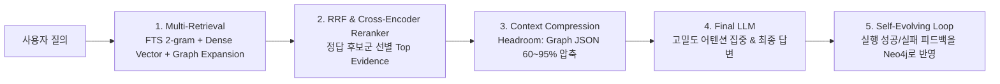

# Graph RAG (지식 그래프 기반 RAG)

## 📌 개념 개요
**Graph RAG**는 문서를 단순 텍스트 청크(Chunk) 단위로 쪼개어 임베딩하는 Naive RAG의 한계를 극복하기 위해, 문서 내 **개체(Entity)**와 **관계(Relationship/Triplets: 주어-동사-목적어)**를 추출하여 지식 그래프(Knowledge Graph)를 먼저 구축한 후 검색 및 추론을 수행하는 차세대 RAG 아키텍처입니다.

---

## ⚙️ 동작 메커니즘
1. **지식 추출 및 인덱싱:** 문서에서 엔티티와 이들 간의 인과/연관 관계를 추출하여 그래프 데이터베이스(예: [[entities/neo4j|Neo4j]])에 노드와 엣지로 저장.
2. **커뮤니티 요약 (Community Summarization):** 군집화 알고리즘으로 연결된 하위 주제 군집을 요약하여 고차원 맥락 생성.
3. **다중 홉 탐색 (Multi-hop Traversal):** 사용자의 복합 질문 발생 시 그래프 탐색을 통해 2차, 3차 연결 경로를 추적.
4. **맥락 주입 및 답변 생성:** 구조화된 서브그래프 경로와 요약 맥락을 LLM에 주입하여 완결성 높은 답변 도출.

---

## 🚀 2026 최신 하이브리드 파이프라인 (Group 2nd Brain 모델)

현대 엔터프라이즈 환경에서는 Graph RAG를 단독으로 쓰지 않고, **고효율 하이브리드 검색 및 사전 압축 계층**과 결합합니다:

1. **정확한 어휘(Exact Match) 보장:** 사내 코드, Lint/CDC 룰셋 검색 시 `FTS(unicode61 2-gram)`로 고유 심볼 100% 매칭.
2. **다단계 연결 추론:** `Neo4j Graph Expansion(KG-MCP)`으로 문서 간 복합 인과관계 추적 (정답률 50%p 이상 개선).
3. **토큰 폭발 방지:** [[concepts/context-compression|Context Compression]]([[entities/headroom|Headroom]])을 Reranker와 LLM 사이에 배치하여 Graph JSON 및 노이즈를 사전 압축.
4. **자가 진화(Self-Evolving):** 에이전트 실행 결과와 피드백을 지식 그래프에 역전파하여 모델 재학습 없이도 영구적으로 진화.

---

## ⚖️ 장점과 한계

| 구분 | 내용 |
|---|---|
| **장점** | 여러 문서에 파편화된 정보의 연결점을 찾는 'Deep Relationship' 쿼리 및 종합적 영향도 분석에 탁월, 대규모(50K+) 코퍼스에서 벡터 허브성(Hubness) 왜곡 극복 |
| **단점** | 초기 지식 그래프 인덱싱 및 트리플렛 추출에 따르는 높은 토큰 비용과 시간 소요 ➡️ Headroom과 같은 압축 계층으로 완화 필수 |

---

## 🔗 연관 지식
- 도구 및 엔진: [[entities/neo4j|Neo4j]], [[entities/headroom|Headroom]]
- 연관 개념: [[concepts/context-compression|Context Compression]], [[concepts/active-second-brain|Active Second Brain]], [[concepts/agentic-rag|Agentic RAG]], [[concepts/llm-wiki-vs-rag|LLM Wiki vs RAG]], [[concepts/memgpt|MemGPT]]

