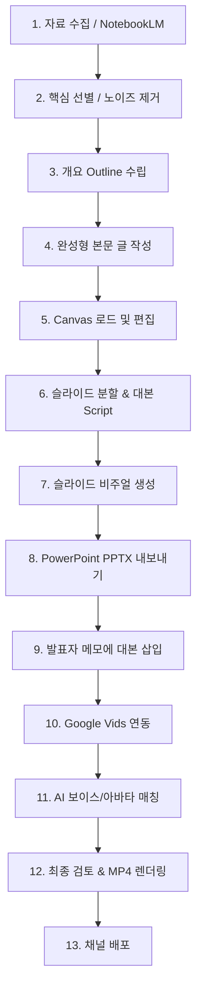

AI 도구를 활용해 연구 자료나 기획안을 고품질 슬라이드 동영상(MP4)으로 신속하게 변환하는 13단계 E2E 제작 워크플로우입니다.

## 핵심 제1원칙 (First Principle)

> **"슬라이드와 영상을 만들기 전에, 반드시 완성형 텍스트 본문과 스토리라인을 먼저 확립해야 한다."**
> - 아무리 뛰어난 생성형 비주얼 도구를 써도, AI가 기획 의도와 핵심 논리까지 대신 결정해주지 않음.
> - "자료 수집 → 개요 정리 → 완성형 본문 글 작성"의 텍스트 빌드업이 선행되어야 비주얼 슬라이드와 AI 보이스 더빙의 완성도가 보장됨.

## 13단계 파이프라인 개요

## 도구 연계 스택
- **리서치 및 개요화:** [[entities/notebooklm]]
- **대본 분할 및 작성:** Google Gemini Canvas
- **슬라이드 비주얼 생성:** [[skills/prompt-creator]] 연계 스타일 프롬프트 (사이버펑크 네온, 멤피스 플랫 등)
- **비디오 변환 및 TTS 더빙:** [[entities/google-vids]]

## 관련 개념 및 스킬
- [[skills/slide-video-pipeline]]
- [[concepts/active-knowledge-pipeline]]
- [[concepts/action-oriented-ai]]
- [[skills/prompt-creator]]
- [[entities/notebooklm]]
- [[entities/google-vids]]
