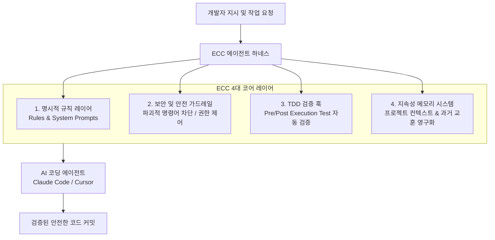

# ECC (Everything Claude Code)

## 📌 개요
**ECC (Everything Claude Code)**는 Claude Code, Cursor, OpenCode 등 차세대 AI 코딩 에이전트의 성능과 행동 양식을 체계적으로 제어하기 위해 제작된 오픈소스 에이전트 하네스(Agent Harness) 프레임워크([github.com/affaan-m/ECC](https://github.com/affaan-m/ECC))입니다.

AI 에이전트가 문법적으로는 유효하나 프로젝트 아키텍처에 위배되거나 엉뚱한 결정을 내리는 현상(Hallucination & Misalignment)을 방지하기 위해, 인간이 직접 통제 가능한 규칙(Rules), 보안 가드레일, TDD 훅, 메모리 지속성 시스템을 표준화된 파일 구조로 패키징했습니다.

- **저장소:** [affaan-m/ECC](https://github.com/affaan-m/ECC)
- **GitHub Stars:** 240,000+ (개발자 커뮤니티 초대형 생태계 형성)
- **지원 에이전트:** Claude Code, Cursor, OpenCode, Codex CLI 등

---

## 🛠️ 핵심 구성 요소 (하네스 아키텍처)

1. **명시적 규칙 체계 (Human-Editable Rules):**
   - 코딩 스타일 가이드, 아키텍처 원칙, 금지된 라이브러리 목록을 파일(`.rules`, `.cursorrules`)로 관리하여 모델이 매 실행마다 엄격히 준수하도록 강제합니다.
2. **보안 및 파괴 방지 가드레일 (Security Guardrails):**
   - 데이터 손실을 유발할 수 있는 위험 명령어(`rm -rf`, 강제 DB 드롭 등)나 민감한 환경 변수(.env) 유출을 사전 차단하는 정책 엔진을 탑재합니다.
3. **TDD 훅 (Test-Driven Development Hooks):**
   - 코드를 수정하기 전 테스트를 먼저 실행하고, 수정 후 즉시 리그레션 테스트를 구동하여 성공 여부를 스스로 검증하는 피드백 루프를 자동화합니다.
4. **지속성 메모리 (Memory Persistence):**
   - 단일 세션이 종료되더라도 이전에 발생했던 버그 해결 경험이나 프로젝트 고유 규칙을 보존하여 다음 세션에 전파합니다.

---

## 💡 [[concepts/harness-engineering|Harness Engineering]]과의 연계

- **하네스 엔지니어링의 완벽한 실체화:**
  - [[concepts/harness-engineering|Harness Engineering]]에서 강조하는 *"AI 결과물에서 'AI 느낌'을 지우고 조직의 요구사항에 맞추기 위해 Rules, Context, Hooks를 시스템화하는 과정"*을 가장 높은 완성도로 표준화한 오픈소스 레퍼런스입니다.
- **메타 개발자의 핵심 도구:**
  - 단순 코더가 아닌 '에이전트를 지휘하고 검증망을 설계하는' [[concepts/human-on-the-loop|Human-on-the-Loop]] 개발자의 필수 하네스로 작동합니다.

---

## 🔗 연관 지식 / 문서
- 연관 개념: [[concepts/harness-engineering|Harness Engineering]], [[concepts/human-on-the-loop|Human-on-the-Loop]], [[concepts/evidence-driven-engineering|Evidence-Driven Engineering]]
- 연관 엔티티: [[entities/codemate|CodeMate]], [[entities/smolcoder|Smolcoder]]
- 소스 링크:
  - [GitHub: affaan-m/ECC](https://github.com/affaan-m/ECC)
