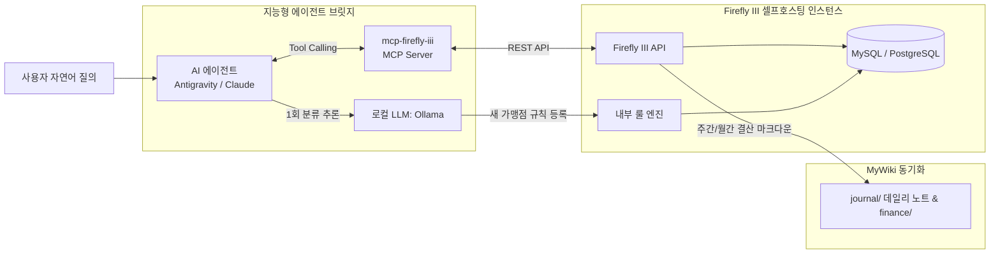

# Firefly III

## 📌 개요
**Firefly III**(파이어플라이 3)는 일반 사용자를 위한 셀프호스팅(Self-Hosted) 오픈소스 개인 자산 및 가계부 관리 시스템([github.com/firefly-iii/firefly-iii](https://github.com/firefly-iii/firefly-iii))입니다. 
민감한 금융 거래 내역, 은행 계좌, 신용카드 사용 내역을 외부 상용 핀테크 서비스나 클라우드 회사에 노출하지 않고, 사용자 소유의 자체 서버(Docker, Raspberry Pi, 로컬 PC)에서 안전하게 관리할 수 있도록 지원합니다.

- **라이선스:** AGPL-3.0
- **기술 스택:** PHP/Laravel, MySQL / PostgreSQL / SQLite, Docker 컨테이너 지원
- **데이터 저장:** 자체 호스팅 데이터베이스 (완전한 데이터 주권 보장)
- **API 지원:** 완전한 명세의 JSON REST API 및 Webhook 지원

---

## 🛠️ 핵심 기능 및 특징

1. **완벽한 데이터 주권 & 프라이버시 (Data Sovereignty):**
   - 계좌 잔액, 소비 패턴, 투자 내역 등 가장 민감한 개인 정보를 100% 로컬 환경에서 보관합니다.
2. **복식부기 기반 정밀 원장 (Double-entry Bookkeeping):**
   - 수입, 지출, 계좌 간 이체, 부채, 자산 계정을 체계적인 복식부기 원칙으로 추적합니다.
3. **지능형 규칙 엔진 (Rule Engine):**
   - 가맹점명, 결제 메모, 금액 조건에 따라 자동으로 거래를 분류(카테고리, 태그, 예산 매칭)하는 강력한 룰 엔진을 기본 내장하고 있습니다.
4. **외부 확장성 (Data Importer & Webhook):**
   - CSV, Nordigen, Spectre 등을 통한 거래 자동 임포터(Data Importer) 및 이벤트 기반 웹훅(Webhook)을 지원합니다.

---

## 🤖 LLM & 에이전틱 세컨드 브레인([[concepts/active-second-brain|Active Second Brain]]) 연동 패턴

### 1. MCP (Model Context Protocol) 연동 (`mcp-firefly-iii`)
- 표준화된 MCP 서버를 배포함으로써, AI 에이전트가 별도의 클라우드 전송 없이 로컬에서 거래 내역 조회, 예산 소진율 확인, 이상 지출 감지 등을 수행하는 툴 콜(Tool Calling) 도구로 동작합니다.
- 예: *"지난달 대비 외식비 지출 추이 분석해줘"*, *"현재 만기 예정인 예적금 목록 보여줘"*.

### 2. "Rule-Writer" 자동화 패턴 (비용 & 속도 최적화)
- 매 거래마다 LLM을 호출하면 비용과 지연 시간이 발생합니다. 
- 새로운 가맹점이나 미분류 거래가 발생했을 때만 로컬 LLM(Ollama 등)이 1회 분석하여 Firefly III의 영구 룰 엔진에 카테고리 규칙을 등록합니다.
- 이후 발생하는 동일 가맹점 거래는 LLM 개입 없이 0ms로 즉시 자동 분류됩니다.

### 3. 세컨드 브레인 저널 자동 동기화
- 주간/월간 결산 데이터를 Markdown 형식으로 요약 추출하여 [[concepts/active-second-brain|MyWiki]]의 `journal/` 데일리 노트나 `finance/` 인덱스로 위키링크 동기화가 가능합니다.

---

## 🔗 연관 지식 / 문서
- 연관 개념: [[concepts/active-second-brain|Active Second Brain]], [[concepts/2nd-brain-system-design-blueprint|2nd Brain System Design Blueprint]]
- 연관 기술: [[concepts/mcp-server|MCP Server]], [[entities/openhuman|OpenHuman]]
- 공식 링크:
  - [Firefly III 공식 웹사이트](https://firefly-iii.org/)
  - [Firefly III GitHub 저장소](https://github.com/firefly-iii/firefly-iii)
  - [Firefly III MCP Server (GitHub)](https://github.com/YakupEmreYerli/mcp-firefly-iii)
