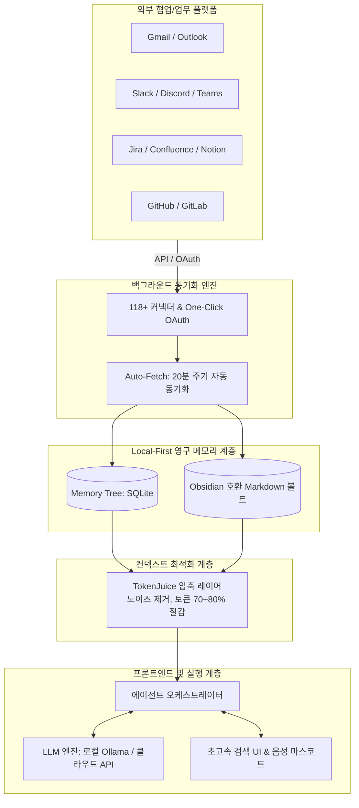

# OpenHuman

## 📌 개요
**OpenHuman**은 TinyHumans AI에서 개발한 오픈소스(GPL-3.0) 개인 AI 에이전트 허브([github.com/tinyhumansai/openhuman](https://github.com/tinyhumansai/openhuman))입니다. 
사용자의 일상적인 업무 도구(Gmail, Slack, Jira, Confluence, Notion, GitHub 등)와 연결하여 업무 맥락을 지속적으로 학습하고 로컬에 영구 보관합니다. 

단순한 일회성 챗봇(Chatbot)이 아니라, 사용자의 컴퓨터 안에서 상주하며 맥락을 기억하고 도구를 자율적으로 실행하는 **"로컬 우선 개인 AI 슈퍼 인텔리전스(Personal AI Super Intelligence)"**를 지향합니다.

- **라이선스:** GPL-3.0
- **개발 언어 및 기술 스택:** Rust (백엔드 코어), TypeScript & React (프론트엔드), Tauri (초경량 데스크톱 런타임)
- **지원 OS:** macOS (Apple Silicon / Intel), Windows (x64 exe / msi), Linux (AppImage)
- **GitHub Stars:** 37,000+ (공개 직후 급상승)

---

## 🏛️ 핵심 아키텍처 및 동작 원리

### 1. 로컬 우선 메모리 구조 (Local-First Memory Tree)
- 모든 수집 데이터는 외부 클라우드가 아닌 사용자 PC 로컬의 **SQLite(구조화 메타데이터 및 검색 인덱스)**와 **Obsidian 호환 Markdown 볼트(Memory Tree)** 형태로 저장됩니다.
- 에이전트가 사용하는 메모리를 사람이 직접 파일로 열람하고 편집·수정할 수 있어, 환각이나 잘못된 기억을 사용자가 직접 통제할 수 있습니다.

### 2. 118개 이상의 원클릭 통합 & 20분 주기 자동 수집 (Auto-fetch)
- Composio 커넥터 레이어를 채택하여 복잡한 API Key 발급 없이 **원클릭 OAuth**로 Gmail, Slack, Jira, Confluence, Teams, GitHub 등을 연결합니다.
- 사용자가 일일이 명령하지 않아도 **20분마다 백그라운드에서 새로운 메일, 댓글, 티켓, 커밋을 자동 수집(Auto-fetch)**하여 최신 컨텍스트를 유지합니다.

### 3. TokenJuice (스마트 토큰 압축 레이어)
- HTML 태그, 메일 서명, 슬랙 보일러플레이트 등의 불필요한 노이즈를 제거하고 Markdown으로 변환하여 모델에 전달되는 토큰 양을 최대 **70%~80%까지 절감**합니다.
- 이는 [[entities/headroom|Headroom]]과 동일한 문제의식을 해결하는 기술로, LLM 비용 절감과 응답 지연 시간 단축, 어텐션 집중도 극대화를 달성합니다.

### 4. 내장 에이전트 도구군
- 웹 검색 및 스크래퍼, 파일 시스템 및 Git/테스트 제어, 크론 스케줄링, 서브 에이전트 생성, 음성 입출력(STT/TTS)을 기본 지원합니다.
- Google Meet 회의에 참가자로 들어가 대화 내용을 실시간 전사(Transcription)하여 메모리에 기록하는 기능도 내장되어 있습니다.

---

## 💡 능동형 세컨드 브레인([[concepts/active-second-brain|Active Second Brain]])과의 연계 가치

1. **파편화된 워크스페이스 데이터의 중앙 집결지:**
   - 개인 지식 노트(MyWiki) 외에 업무 현장에서 실시간으로 쏟아지는 Email, Slack, Jira 로그를 로컬 마크다운으로 추출해 주므로, 세컨드 브레인의 **Phase 1 Ingestion 레이어**를 완벽하게 담당할 수 있습니다.
2. **Obsidian 상호 운용성:**
   - 수집된 메모리가 옵시디언 표준 마크다운 구조이므로, MyWiki의 Graph RAG 및 [[concepts/2nd-brain-system-design-blueprint|2nd Brain Blueprint]]와 아무런 장벽 없이 결합될 수 있습니다.

---

## 🔗 연관 지식 / 문서
- 연관 개념: [[concepts/active-second-brain|Active Second Brain]], [[concepts/2nd-brain-system-design-blueprint|2nd Brain System Design Blueprint]], [[concepts/context-compression|Context Compression]]
- 유사/연계 도구: [[entities/headroom|Headroom]], [[entities/firefly-iii|Firefly III]], [[entities/neo4j|Neo4j]]
- 소스 링크:
  - [공식 웹사이트](https://tinyhumans.ai/openhuman)
  - [GitHub 저장소](https://github.com/tinyhumansai/openhuman)
  - [이랜서 블로그 분석 가이드](https://www.elancer.co.kr/blog/detail/1111)
  - [Honbul 컴퓨터 블로그 리뷰](https://honbul.tistory.com/266)
