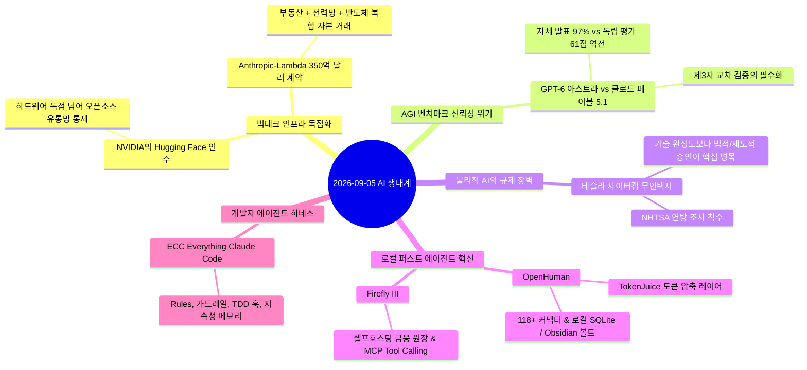

# 🌐 2026-09-05 AI 트렌드 및 에코시스템 종합 분석

## 📌 개요
2026년 9월 5일자 매일 IT 뉴스 및 오픈소스 트렌드를 관통하는 핵심 흐름은 **"빅테크의 인프라·유통망 수직 통합"**과 **"개인/로컬 레벨의 자율형 에이전트 하네스 성숙"**이라는 거대한 양극화 및 고도화 현상입니다.

---

## 🏛️ 거시적 5대 핵심 트렌드 분석

### 1. AI 유통 플랫폼의 수직 통합: NVIDIA의 Hugging Face 인수 (129.3억 달러)
- **현상:** 엔비디아가 전 세계 300만 개 이상의 오픈소스 모델이 유통되는 허깅 페이스를 전격 인수.
- **인사이트:** GPU 하드웨어 공급 독점을 넘어, AI 모델의 공급과 배포 경로(AI계의 GitHub) 전체를 장악하여 대체 불가능한 수직 통합 생태계를 완성함.

### 2. 컴퓨팅 인프라 거래의 대형화 및 복합 자본화: Anthropic 350억 달러 계약
- **현상:** 앤스로픽이 람다(Lambda)와 15년 장기 연산 계약 체결.
- **인사이트:** 단순 클라우드 API 결제 단계를 벗어나, **부지(데이터센터 부동산) + 전력망 확보 + 반도체 수급**이 단일 패키지로 결합된 국가 기반시설 수준의 복합 자본 투자가 필수 조건이 됨.

### 3. AGI 발표 지표와 제3자 검증의 괴리: GPT-6 '아스트라' 벤치마크 논란
- **현상:** OpenAI 자체 평가에서는 경이로운 성과(수학 97.6%)를 발표했으나, 독립 평가 기관(*Artificial Analysis*)의 객관적 지능 지수에서는 61점을 기록해 Anthropic Claude Fable 5.1(66점)에 뒤처짐.
- **인사이트:** 모델 제조사의 자체 벤치마크 마케팅에 대한 신뢰성 피로도가 누적되면서, 다각적인 **독립 교차 검증(Third-party Independent Verification)** 체계가 업계의 핵심 기준으로 대두됨.

### 4. 물리적 AI(Physical AI) 상용화의 병목: 테슬라 사이버캡 조사
- **현상:** 핸들/페달이 없는 사이버캡 무인 주행 개시 직후 미국 NHTSA(도로교통안전국) 연방 조사 개시.
- **인사이트:** 기술적 주행 완성도 자체보다, 안전 기준 면제(Exemption) 획득 및 규제 기관과의 합의 같은 **제도적·법률적 이행 절차**가 실제 AGI/Physical AI 서비스 배포의 최대 승부처임이 입증됨.

### 5. 오픈소스 진영의 역습: 로컬 에이전트와 하네스 엔지니어링의 도약
- **현상:** 대형 클라우드 SaaS 의존을 탈피하려는 움직임이 가속화되며, 깃허브 스타 수만 개 규모의 프로젝트들이 트렌딩을 석권.
  - **[[entities/openhuman|OpenHuman]]:** 로컬 SQLite와 Obsidian 마크다운 볼트를 결합한 20분 주기 업무 수집 에이전트.
  - **[[entities/ecc|ECC]]:** 에이전트의 오작동을 제어하는 Rules, 가드레일, TDD 훅 기반의 완성형 하네스.
  - **[[entities/firefly-iii|Firefly III]]:** MCP 서버와 로컬 LLM을 결합한 데이터 주권형 금융 원장.

---

## 💡 KIHOKIL 세컨드 브레인 아키텍처에의 시사점

1. **하네스 엔지니어링 역량의 내재화:**
   - LLM 모델 성능이 상향 평준화될수록, 모델 자체보다 모델을 감싸는 **규칙(Rules), 검증 도구(TDD Hooks), 컨텍스트 압축([[entities/headroom|Headroom]] / TokenJuice)** 시스템 설계 역량이 승패를 가름.
2. **Local-First 하이브리드 아키텍처 가속화:**
   - 개인 지식(MyWiki), 업무 맥락([[entities/openhuman|OpenHuman]]), 금융 원장([[entities/firefly-iii|Firefly III]])을 로컬 우선으로 결합하는 [[concepts/active-second-brain|능동형 세컨드 브레인]] 전략이 최신 기술 트렌드와 가장 완벽하게 부합함을 재확인.

---

## 🔗 연관 지식 / 문서
- 연관 개념: [[concepts/active-second-brain|Active Second Brain]], [[concepts/harness-engineering|Harness Engineering]], [[concepts/physical-ai|Physical AI]]
- 연관 엔티티: [[entities/openhuman|OpenHuman]], [[entities/firefly-iii|Firefly III]], [[entities/ecc|ECC]]
- 원본 소스: `[[_sources/Study/AI-Lectures/편한AI/20260905/github-trend-2026-09-05.md]]`
